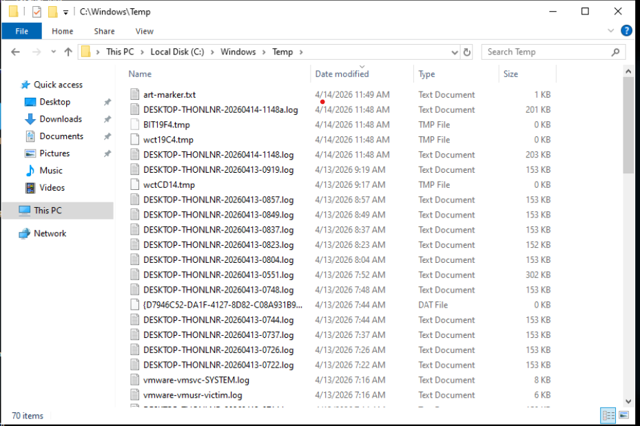
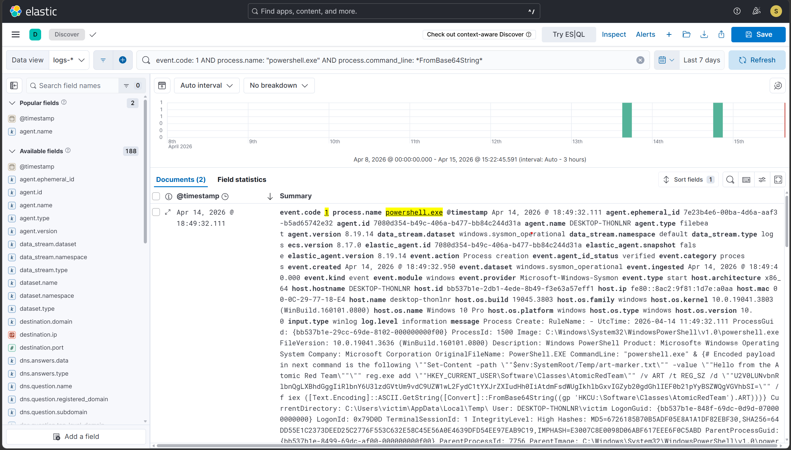
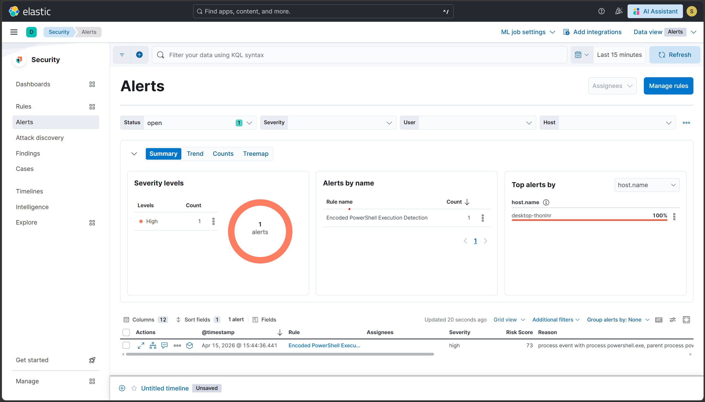

# Scenario 1 — T1059.001: PowerShell Fileless Execution

## Overview
| Field        | Value                                      |
|--------------|--------------------------------------------|
| Technique    | T1059.001 — Command and Scripting: PowerShell |
| Atomic test  | Test #11 — PowerShell Fileless Script Execution |
| Internet     | Not required                               |
| Sysmon event | Event ID 1 (Process Creation), ID 13 (Registry) |
| Severity     | High                                       |
| Result       | ✅ Detected                                |

## What the attack does
The attacker stores a base64-encoded PowerShell payload inside a
registry key (HKU\\S-1-5-21-3933135484-4220633899-146828341-1001_Classes\\mssharepointclient\\shell\\open\\command\\(Default)), then executes
it using IEX and [Convert]::FromBase64String. No file is written to
disk before execution — this is a fileless technique designed to
evade file-based antivirus scanning.

## How it was simulated
```powershell
Invoke-AtomicTest T1059.001 -TestNumbers 10
```
Proof of execution: C:\Windows\Temp\art-marker.txt was created
containing "Hello from the Atomic Red Team".

## Detection signals observed
| Signal             | Details                                          |
|--------------------|--------------------------------------------------|
| Sysmon Event ID 1  | powershell.exe with FromBase64String in cmd line |
| Sysmon Event ID 13 | Registry write to HKU\S-1-5-21-...-1001_Classes\mssharepointclient\shell\open\command\(Default)|
| ELK Alert          | Rule fired within 5 min of execution             |

## Detection rule (KQL)
```
process.name : ("powershell.exe" OR "pwsh.exe") AND (
  process.command_line : *FromBase64String* OR
  process.command_line : *IEX* OR
  process.command_line : *Invoke-Expression* OR
  process.command_line : *-e * OR 
  process.command_line : *-en * OR 
  process.command_line : *-enc * OR 
  process.command_line : *-encodedCommand *
)
```

## Evidence




## Detection score
> **Detected** — Sysmon logged the execution and the custom ELK rule
> generated a High severity alert within 5 minutes.

## References
- https://attack.mitre.org/techniques/T1059/001/
- https://github.com/redcanaryco/atomic-red-team/blob/master/atomics/T1059.001/T1059.001.md