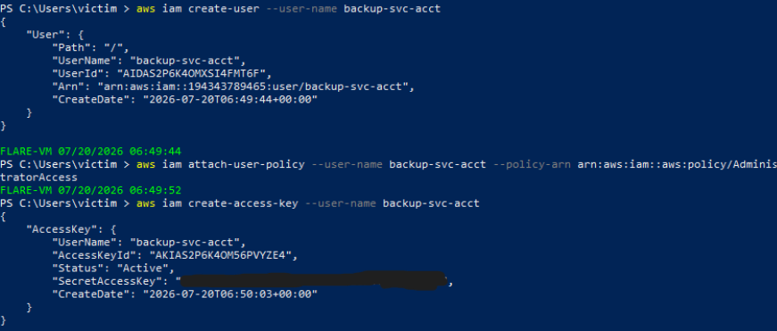
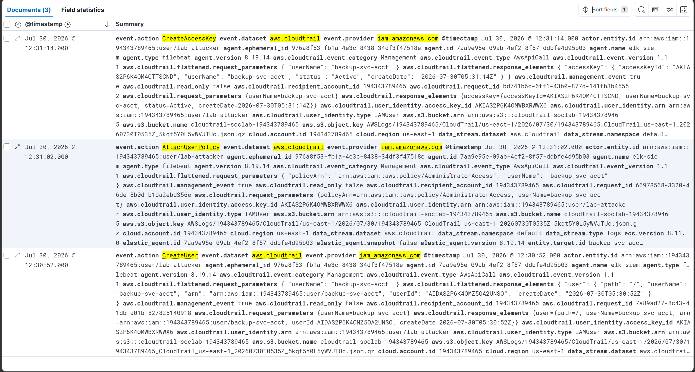
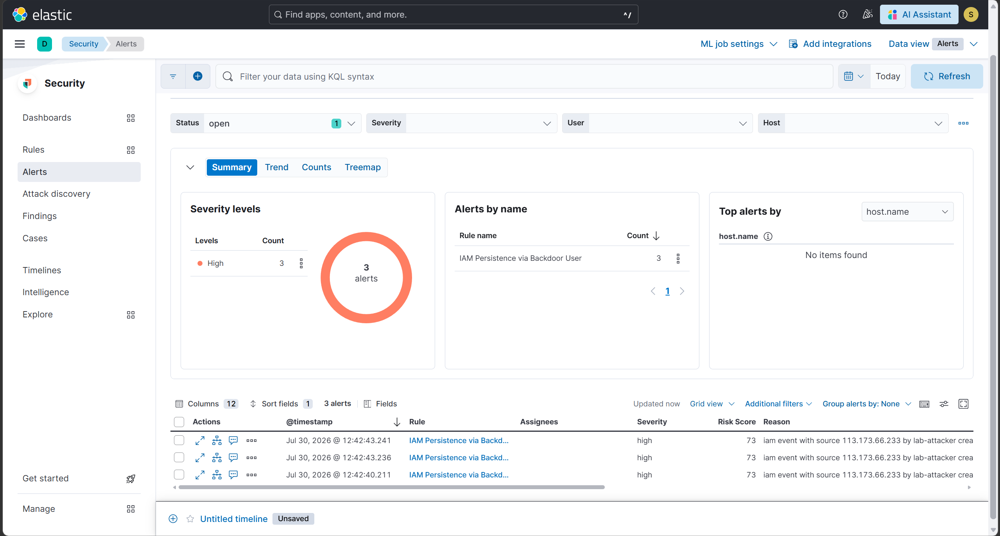
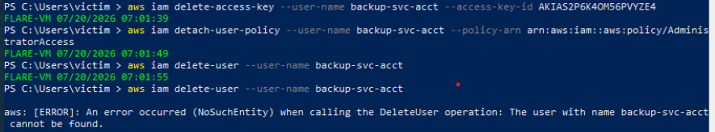

# Scenario 10 — T1098: IAM Persistence via Backdoor Admin User

## Overview
| Field        | Value                                                     |
|--------------|-----------------------------------------------------------|
| Technique    | T1098 — Account Manipulation                              |
| Simulation   | AWS CLI — CreateUser → AttachUserPolicy → CreateAccessKey |
| Internet     | Required (AWS API calls)                                  |
| CloudTrail   | CreateUser, AttachUserPolicy, CreateAccessKey             |
| Severity     | High                                                      |
| Result       | ✅ Detected                                               |

## What the attack does
Once an adversary has valid credentials with IAM write access,
one of the most durable footholds they can establish is a brand
new IAM user with administrative privileges and its own access
key. Unlike compromising an existing account, a freshly created
user with a plausible name (e.g. "backup-svc-acct") can blend
into an account's IAM user list and survive password rotations
or session revocations on the originally compromised identity.
The access key gives the attacker programmatic access independent
of the console entirely.

## How it was simulated
```bash
aws iam create-user --user-name backup-svc-acct

aws iam attach-user-policy --user-name backup-svc-acct --policy-arn arn:aws:iam::aws:policy/AdministratorAccess

aws iam create-access-key --user-name backup-svc-acct
```
Proof of execution: 3 chained CloudTrail events for
backup-svc-acct within 1 second of each other.

## Detection signals observed
| Signal                              | Details                                       |
|-------------------------------------|-----------------------------------------------|
| event.provider                      | iam.amazonaws.com                             |
| event.action (×3)                   | CreateUser, AttachUserPolicy, CreateAccessKey |
| Target user                         | backup-svc-acct                               |
| Policy attached                     | AdministratorAccess                           |
| ELK Alert                           | Rule fired within 11 minutes                  |

## Detection rule (KQL)
```
event.dataset: "aws.cloudtrail" AND
event.provider: "iam.amazonaws.com" AND
event.action: ("CreateUser" OR "AttachUserPolicy" OR "CreateAccessKey") AND
NOT aws.cloudtrail.user_identity.arn: "*terraform*"
```

## Why this detection works
The rule matches on the action pattern, not on the account name
chosen — it would fire regardless of what the attacker named the
backdoor user. The terraform exclusion prevents the partner's IaC
pipeline from self-triggering the rule during legitimate resource
provisioning, without weakening detection against a manually
created identity.

## Cleanup
AWS requires access keys to be removed before a user can be
deleted, so cleanup is a 4-step sequence rather than the 2-step
version in the original phase plan:
```bash
aws iam list-access-keys --user-name backup-svc-acct
aws iam delete-access-key --user-name backup-svc-acct --access-key-id <AccessKeyId>
aws iam detach-user-policy --user-name backup-svc-acct --policy-arn arn:aws:iam::aws:policy/AdministratorAccess
aws iam delete-user --user-name backup-svc-acct

# Verify:
aws iam get-user --user-name backup-svc-acct
# Must return: NoSuchEntity
```

## Evidence





## Detection score
> **Detected** — CloudTrail captured the full CreateUser →
> AttachUserPolicy → CreateAccessKey chain, and the custom ELK
> rule generated a High severity alert within 11 minutes.
> Full cleanup verified via NoSuchEntity on get-user.

## References
- https://attack.mitre.org/techniques/T1098/
- https://docs.aws.amazon.com/IAM/latest/UserGuide/id_users_manage.html