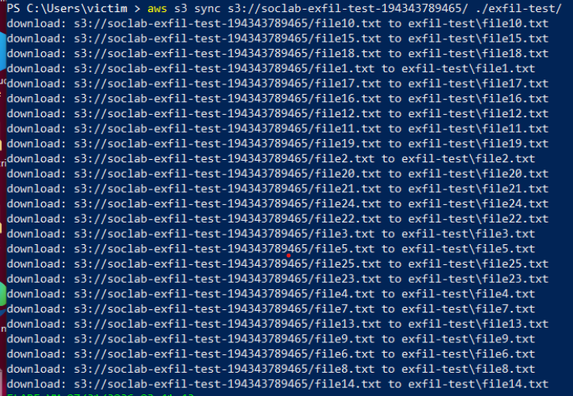
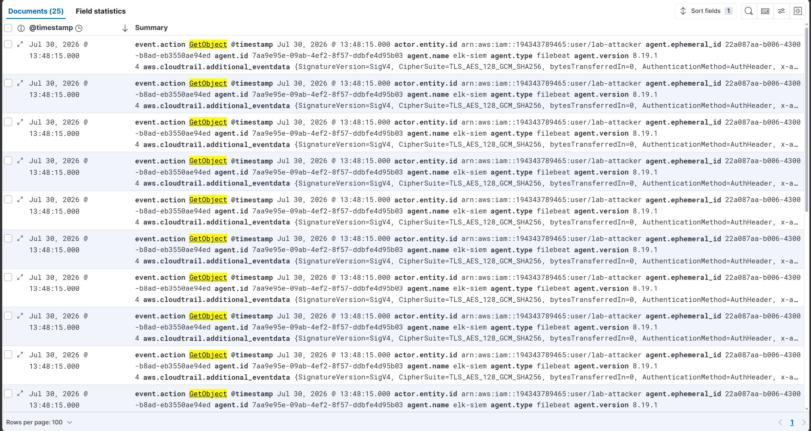
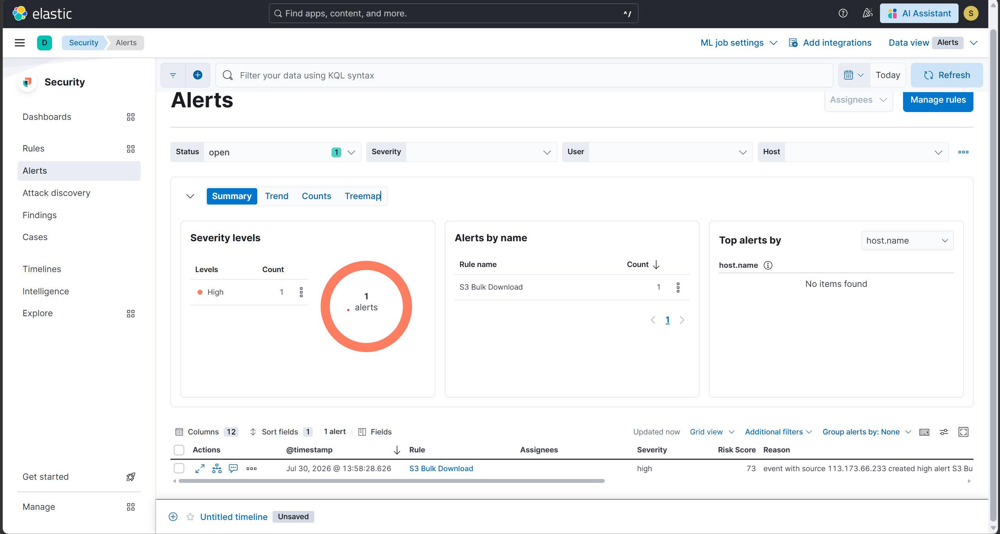

# Scenario 11 — T1530: S3 Data Exfiltration (Bulk Download)

## Overview
| Field        | Value                                               |
|--------------|-----------------------------------------------------|
| Technique    | T1530 — Data from Cloud Storage                     |
| Simulation   | AWS CLI — aws s3 sync bulk download                 |
| Internet     | Required (AWS API calls)                            |
| CloudTrail   | GetObject (data event, not a management event)      |
| Severity     | High                                                |
| Result       | ✅ Detected                                         |

## What the attack does
Once an adversary has read access to an S3 bucket, downloading
its contents in bulk is a direct path to data theft. A single
GetObject call is indistinguishable from routine, legitimate
access — the signal that separates exfiltration from normal use
is volume: many object retrievals from one source in a short
window. This scenario simulates that volume pattern against a
disposable test bucket rather than production data.

## Prerequisite: enabling S3 data events
Object-level S3 API calls (GetObject, PutObject, DeleteObject)
are CloudTrail data events, a separate opt-in category from the
management events captured by the trail set up in Phase 3. A
data event selector for GetObject was added, scoped to this one
test bucket only, before running the simulation — without this
step the download would generate no CloudTrail record at all.

## How it was simulated
```bash
# Setup: 25 dummy files uploaded to a disposable test bucket
aws s3 mb s3://soclab-exfil-test-
for ($i = 1; $i -le 25; $i++) {
    $file = "file$i.txt"
    "dummy file $i" | Out-File $file
    aws s3 cp $file "s3://soclab-exfil-test-/"
}

# Simulation
aws s3 sync s3://soclab-exfil-test-/ ./exfil-test/
```
Proof of execution: 25 GetObject events recorded from a single
source.ip within almost 1 second of each other.

## Detection signals observed
| Signal                              | Details                                 |
|-------------------------------------|-----------------------------------------|
| event.action                        | GetObject ×25                           |
| source.ip                           | single origin, all 25 calls             |
| Burst window                        | almost 1 second                         |
| ELK Alert                           | Rule fired within 10 minutes            |

## Detection rule (Threshold, not custom query)
```
Rule type:  Threshold
Query:      event.dataset: "aws.cloudtrail" and event.action: "GetObject"
Group by:   source.ip
Threshold:  >= 20 events in 5 minutes
```

## Why a Threshold rule instead of a custom query
Unlike the earlier cloud scenarios, this detection is built as a
genuine Threshold rule rather than a custom query annotated with
a manually observed burst window. A single GetObject is normal S3
usage and would generate constant false positives if alerted on
directly; grouping by source.ip and requiring a minimum count
within a rolling window is what actually encodes "bulk download"
as a rule condition rather than as a README observation. This is
the approach flagged as a future improvement in Scenario 9's IAM
recon detection, implemented here in full.

## Evidence




## Detection score
> **Detected** — 25 GetObject calls from a single source were
> captured once the data event selector was enabled, and the
> Threshold rule generated a High severity alert within
> 10 minutes once the count crossed 20 events in 5 minutes.

## Cleanup
```bash
# Remove the data event selector via the CloudTrail console
# (Trails → your trail → Data events → remove selector)

Remove-Item -Recurse -Force .\exfil-test
aws s3 rm s3://soclab-exfil-test- --recursive
aws s3 rb s3://soclab-exfil-test-
```

## References
- https://attack.mitre.org/techniques/T1530/
- https://docs.aws.amazon.com/awscloudtrail/latest/userguide/logging-data-events-with-cloudtrail.html
