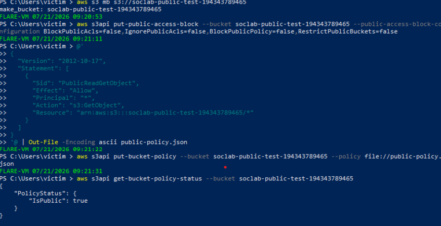
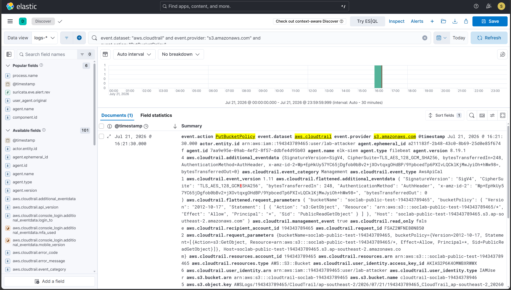
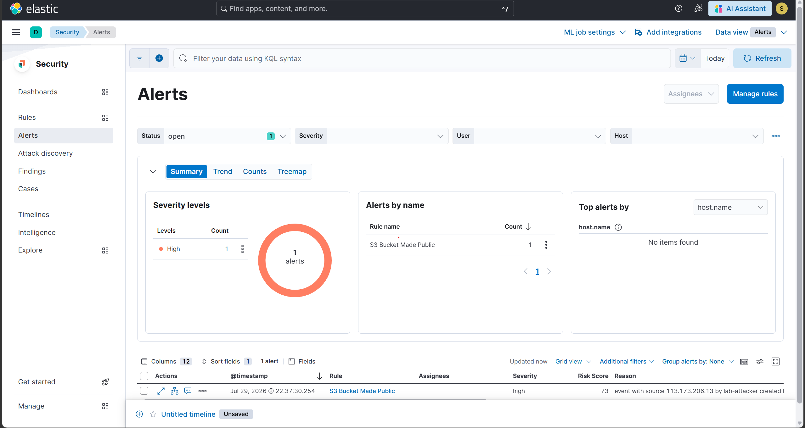

# Scenario 12 — T1537: S3 Bucket Made Public

## Overview
| Field        | Value                                              |
|--------------|-----------------------------------------------------|
| Technique    | T1537 — Transfer Data to Cloud Account               |
| Simulation   | AWS CLI — public bucket policy applied               |
| Internet     | Required (AWS API calls)                             |
| CloudTrail   | PutBucketPolicy                                      |
| Severity     | High                                                |
| Result       | ✅ Detected                                         |

## What the attack does
Misconfiguring an S3 bucket to be publicly readable is one of the
most common real-world cloud data exposure incidents. An
adversary with write access to bucket policies — or a well-
meaning but careless change — can attach a policy granting
s3:GetObject to Principal "*", making every object in the bucket
retrievable by anyone on the internet without authentication.
Because Block Public Access is enabled by default on new AWS
accounts and buckets, achieving this requires either disabling
BPA first or targeting a bucket where it was never turned on —
itself a signal worth detecting.

## How it was simulated
```bash
# Prerequisite: disable Block Public Access on a disposable test bucket
aws s3api put-public-access-block `
  --bucket soclab-public-test- `
  --public-access-block-configuration BlockPublicAcls=false,IgnorePublicAcls=false,BlockPublicPolicy=false,RestrictPublicBuckets=false

# Apply a public-read policy
aws s3api put-bucket-policy `
  --bucket soclab-public-test- `
  --policy file://public-policy.json
```
Proof of execution: get-bucket-policy-status confirmed
PolicyStatus.IsPublic: true immediately after the policy was
applied — the API call was verified against actual resulting
state, not assumed successful from a 200 response alone.

## Detection signals observed
| Signal                                | Details                                |
|----------------------------------------|-----------------------------------------|
| event.action                          | PutBucketPolicy                         |
| event.provider                        | s3.amazonaws.com                        |
| aws.cloudtrail.request_parameters     | Principal: "*", Action: s3:GetObject    |
| ELK Alert                             | Rule fired within 20 minutes     |

## Detection rule (KQL)
```
event.dataset: "aws.cloudtrail" AND
event.provider: "s3.amazonaws.com" AND
event.action: ("PutBucketPolicy" OR "PutBucketAcl" OR "PutPublicAccessBlock") AND
aws.cloudtrail.request_parameters: (*AllUsers* OR *Principal*)
```

## Why this detection works
The rule covers three distinct ways a bucket can be exposed — a
policy change, an ACL change, or a direct loosening of the Block
Public Access configuration — rather than only the one method
used in this simulation. Matching on the presence of a public
principal in the request parameters, rather than a specific
bucket name, means the rule generalizes to any bucket in the
account.

## Evidence




## Detection score
> **Detected** — CloudTrail captured the PutBucketPolicy event
> with a public Principal, and the custom ELK rule generated a
> High severity alert within 20 minutes. The bucket policy
> was reverted and Block Public Access re-enabled immediately
> after confirmation, verified via a subsequent
> get-bucket-policy-status error.

## Cleanup
```powershell
aws s3api delete-bucket-policy --bucket soclab-public-test-194343789465

aws s3api put-public-access-block `
  --bucket soclab-public-test-194343789465 `
  --public-access-block-configuration BlockPublicAcls=true,IgnorePublicAcls=true,BlockPublicPolicy=true,RestrictPublicBuckets=true

# Verify closed:
aws s3api get-bucket-policy-status --bucket soclab-public-test-
# Expect: error (no bucket policy)

aws s3 rm s3://soclab-public-test- --recursive
aws s3 rb s3://soclab-public-test-
```

## References
- https://attack.mitre.org/techniques/T1537/
- https://docs.aws.amazon.com/AmazonS3/latest/userguide/access-control-block-public-access.html