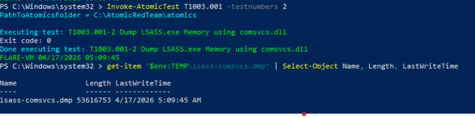
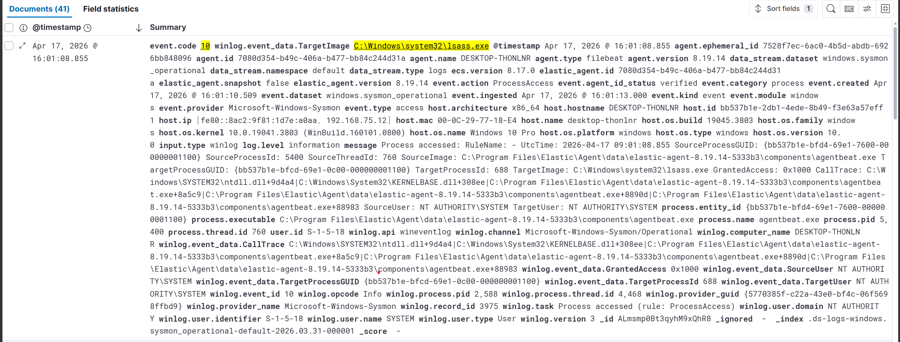
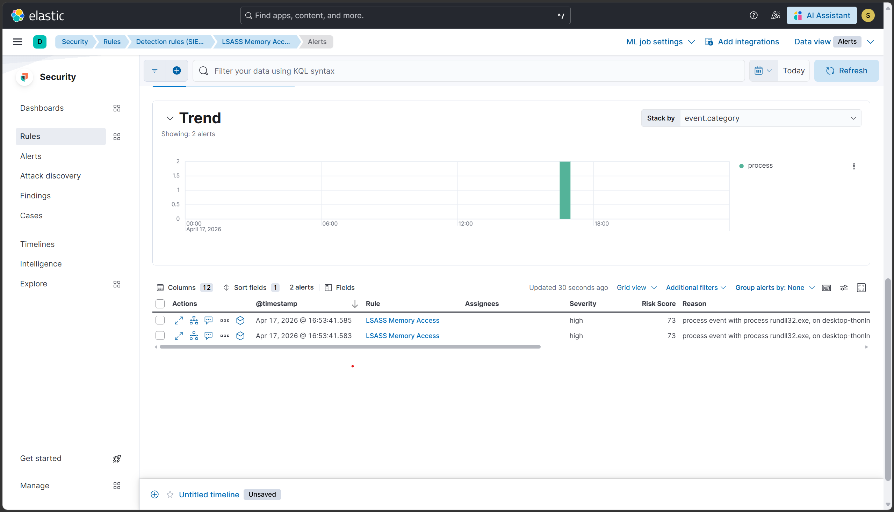

# Scenario 2 — T1003.001: LSASS Memory Dump via comsvcs.dll

## Overview
| Field        | Value                                            |
|--------------|--------------------------------------------------|
| Technique    | T1003.001 — OS Credential Dumping: LSASS Memory  |
| Atomic test  | Test #1 — Dump LSASS.exe Memory using comsvcs.dll |
| Internet     | Not required                                     |
| Sysmon event | Event ID 10 (ProcessAccess)                      |
| Severity     | High                                             |
| Result       | ✅ Detected                                      |

## What the attack does
The attacker uses rundll32.exe to call the MiniDump export function
inside comsvcs.dll — a legitimate Windows DLL — to dump the memory
of lsass.exe to disk. Because only built-in Windows binaries are
used (a LOLBin technique), there is no malware file to detect.
The resulting dump file contains NTLM hashes and Kerberos tickets
that can be used offline for credential theft.

## How it was simulated
```powershell
Invoke-AtomicTest T1003.001 -TestNumbers 2
```
Proof of execution: %TEMP%\lsass-comsvcs.dmp was created
(file size: 50MB).

## Why this detection is powerful
The ELK rule detects based on *process access behavior*, not file
signatures. Any tool that touches lsass.exe with credential-dumping
access masks — Mimikatz, ProcDump, comsvcs, or custom malware —
will trigger this rule, even if the tool itself is unknown to
antivirus.

## Detection signals observed
| Signal              | Details                                           |
|---------------------|---------------------------------------------------|
| Sysmon Event ID 10  | rundll32.exe → lsass.exe, GrantedAccess: 0x1fffff |
| CallTrace           | comsvcs.dll visible in the call stack             |
| ELK Alert           | Rule fired within 5 min of execution              |

## Detection rule (KQL)
```
event.code: "10" AND
winlog.event_data.TargetImage: *lsass.exe AND
winlog.event_data.GrantedAccess: (
"0x1fffff" OR "0x1010" OR "0x1410" OR "0x143a" OR "0x1438"
) AND
NOT process.name: (
"MsMpEng.exe" OR "MsSense.exe" OR "SenseCncProxy.exe" OR
"elastic-agent.exe" OR "agentbeat.exe" OR
"csrss.exe" OR "wininit.exe" OR "lsass.exe"
) AND
NOT (process.name: "svchost.exe" AND winlog.event_data.GrantedAccess: "0x1410") AND
NOT (process.name: "wmiprvse.exe" AND winlog.event_data.CallTrace: "cimwin32.dll") AND
NOT (process.name: "taskmgr.exe" AND winlog.event_data.GrantedAccess: ("0x1010" OR "0x1410"))
```

## Evidence




## Detection score
> **Detected** — Sysmon Event ID 10 captured the process access and
> the custom ELK rule generated a High severity alert within 5 minutes.

## References
- https://attack.mitre.org/techniques/T1003/001/
- https://github.com/redcanaryco/atomic-red-team/blob/master/atomics/T1003.001/T1003.001.md
- https://lolbas-project.github.io/lolbas/Libraries/Comsvcs/