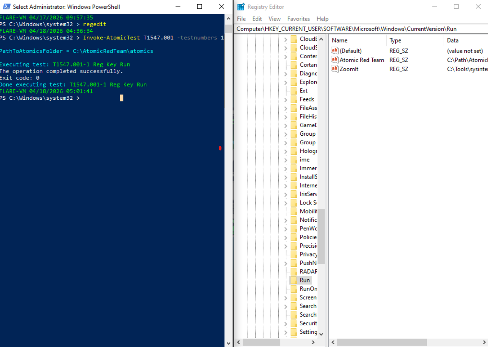
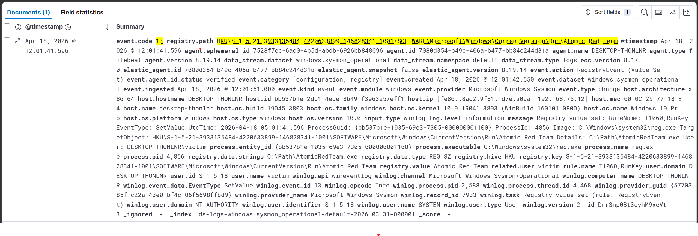
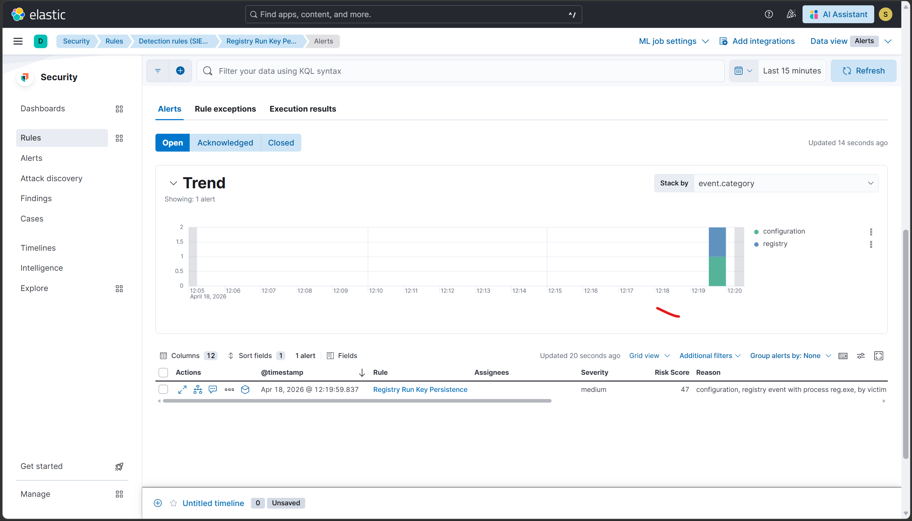

# Scenario 3 — T1547.001: Registry Run Key Persistence

## Overview
| Field        | Value                                              |
|--------------|----------------------------------------------------|
| Technique    | T1547.001 — Boot/Logon Autostart: Registry Run Key |
| Atomic test  | Test #1 — Reg Key Run and Run Once                 |
| Internet     | Not required                                       |
| Sysmon event | Event ID 13 (Registry Value Set)                   |
| Severity     | Medium                                             |
| Result       | ✅ Detected                                        |

## What the attack does
The attacker writes a new value to the Windows registry Run key
(HKCU\Software\Microsoft\Windows\CurrentVersion\Run) pointing to
a malicious executable. Windows automatically launches every value
in this key when the user logs in, giving the attacker persistent
execution across reboots and credential changes without needing
to modify any system files.

## How it was simulated
```powershell
Invoke-AtomicTest T1547.001 -TestNumbers 1
```
Proof of execution: registry value "Atomic Red Team" was created
under HKCU\...\CurrentVersion\Run pointing to cmd.exe.

Verified via PowerShell:
```powershell
Get-ItemProperty "HKCU:\Software\Microsoft\Windows\CurrentVersion\Run" |
  Select-Object "Atomic Red Team"
```

## Why Medium severity and not High
Legitimate software (OneDrive, Teams, security tools) also writes
to Run keys. The rule excludes known-good writers (MsMpEng.exe,
svchost.exe, OneDrive.exe) and fires Medium severity so analysts
investigate without treating every login app as an incident.

## Detection signals observed
| Signal              | Details                                              |
|---------------------|------------------------------------------------------|
| Sysmon Event ID 13  | reg.exe wrote to HKCU\...\CurrentVersion\Run         |
| registry.path       | ...\Run\Atomic Red Team                              |
| registry.value      | cmd.exe command set as persistence payload           |
| ELK Alert           | Rule fired within 5 min of execution                 |

## Detection rule (KQL)
```
event.code: 13 AND
registry.path: (*\\CurrentVersion\\Run\\* OR *\\CurrentVersion\\RunOnce\\*) AND
NOT process.name: ("MsMpEng.exe" OR "svchost.exe" OR "OneDrive.exe")
```

## Evidence




## Detection score
> **Detected** — Sysmon Event ID 13 captured the registry write and
> the custom ELK rule generated a Medium severity alert within 5 min.

## Cleanup
```powershell
Invoke-AtomicTest T1547.001 -TestNumbers 1 -Cleanup
```

## References
- https://attack.mitre.org/techniques/T1547/001/
- https://github.com/redcanaryco/atomic-red-team/blob/master/atomics/T1547.001/T1547.001.md