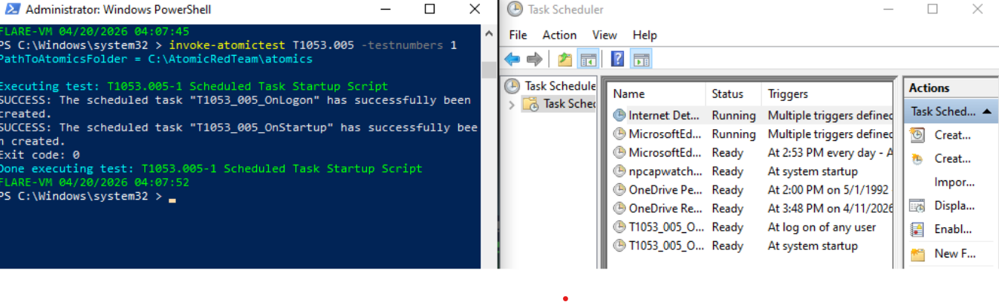
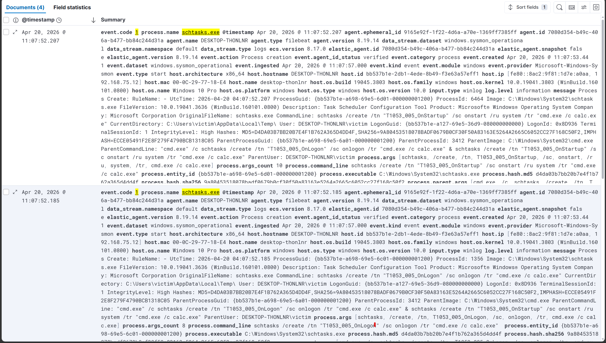
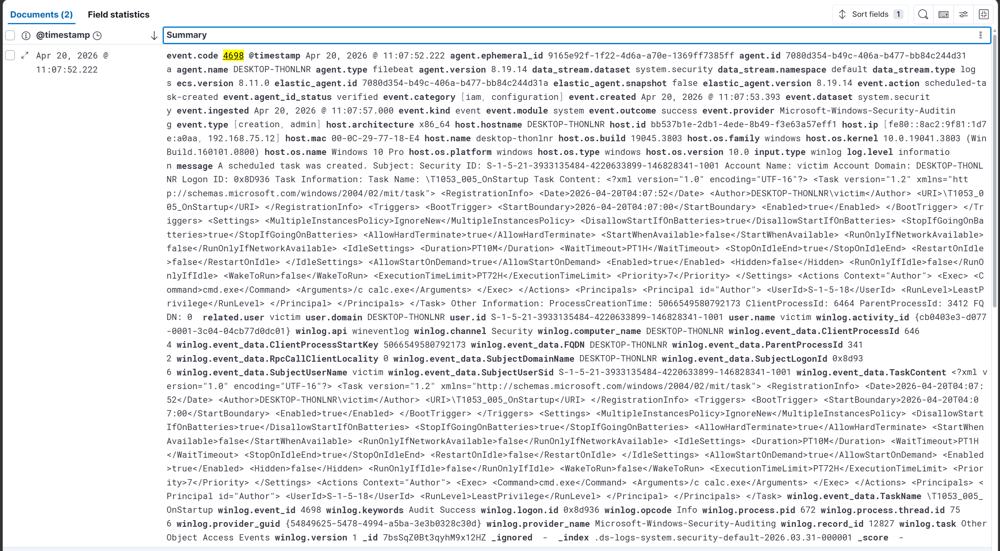
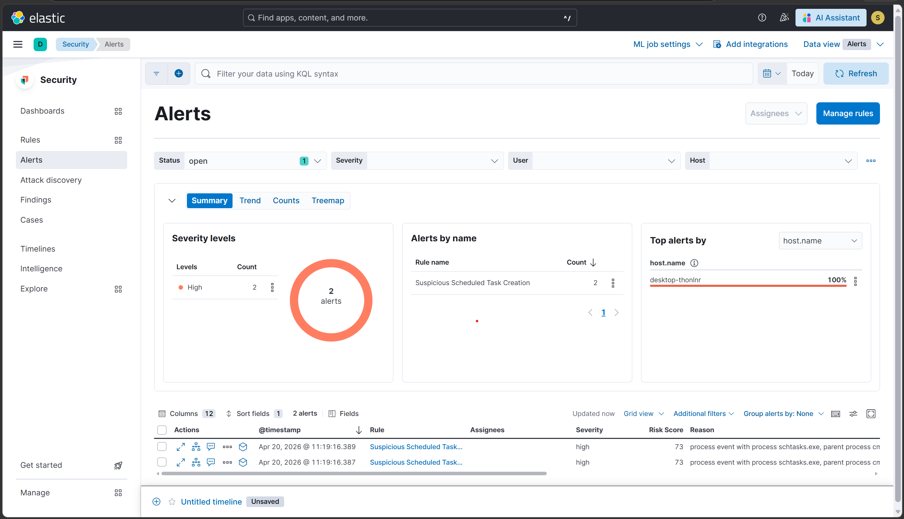

# Scenario 4 — T1053.005: Scheduled Task Persistence

## Overview
| Field        | Value                                              |
|--------------|----------------------------------------------------|
| Technique    | T1053.005 — Scheduled Task/Job: Scheduled Task     |
| Atomic test  | Test #1 — Scheduled Task Startup Script            |
| Internet     | Not required                                       |
| Sysmon event | Event ID 1 (Process Creation — schtasks.exe)       |
| Windows event| Event ID 4698 (Scheduled task created)             |
| Severity     | High                                               |
| Result       | ✅ Detected                                        |

## What the attack does
The attacker uses the built-in schtasks.exe utility to register two
persistent tasks: one that executes on every user logon and one that
executes on every system startup. Both tasks run cmd.exe /c calc.exe
as a benign payload stand-in. In a real attack, calc.exe would be
replaced by a reverse shell, dropper, or RAT. The technique survives
reboots and does not require any files to be dropped in sensitive
locations, making it harder to detect with file-based monitoring.

## How it was simulated
```powershell
Invoke-AtomicTest T1053.005 -TestNumbers 1
```
Two tasks were created:
- T1053_005_OnLogon  → trigger: At log on  → action: cmd.exe /c calc.exe
- T1053_005_OnStartup → trigger: At startup → action: cmd.exe /c calc.exe

Confirmed via PowerShell:
```powershell
Get-ScheduledTask | Where-Object {$_.TaskName -like "*T1053*"} |
  Select-Object TaskName, State
```

## Two independent log sources caught this attack
This scenario is notable because two completely separate logging
pipelines both captured the same technique:

1. **Sysmon Event ID 1** — caught schtasks.exe being spawned with
   /create flags, visible in process.command_line
2. **Windows Security Event 4698** — a native Windows audit event
   fired independently of Sysmon, recording the task name and action

Having two independent signals increases detection reliability —
if one logging pipeline fails, the other still catches it.

## Detection signals observed
| Signal                  | Details                                         |
|-------------------------|-------------------------------------------------|
| Sysmon Event ID 1       | schtasks.exe /create /sc onlogon + /sc onstart  |
| Windows Event ID 4698   | "A scheduled task was created" — both task names|
| ELK Alert               | Rule fired twice (once per task created)         |

## Detection rule (KQL)
```
event.code: 1 AND
process.name: "schtasks.exe" AND
process.command_line: (*onlogon* OR *onstart* OR *ONCE* OR *DAILY*) AND
NOT process.parent.name: ("svchost.exe" OR "taskhostw.exe")
```

## Evidence





## Detection score
> **Detected** — Both Sysmon Event ID 1 and Windows Security Event
> 4698 logged the attack. The custom ELK rule generated two High
> severity alerts (one per task) within 5 minutes of execution.

## Cleanup
```powershell
Invoke-AtomicTest T1053.005 -TestNumbers 1 -Cleanup
# Verify:
Get-ScheduledTask | Where-Object {$_.TaskName -like "*T1053*"}
# Must return nothing
```

## References
- https://attack.mitre.org/techniques/T1053/005/
- https://github.com/redcanaryco/atomic-red-team/blob/master/atomics/T1053.005/T1053.005.md