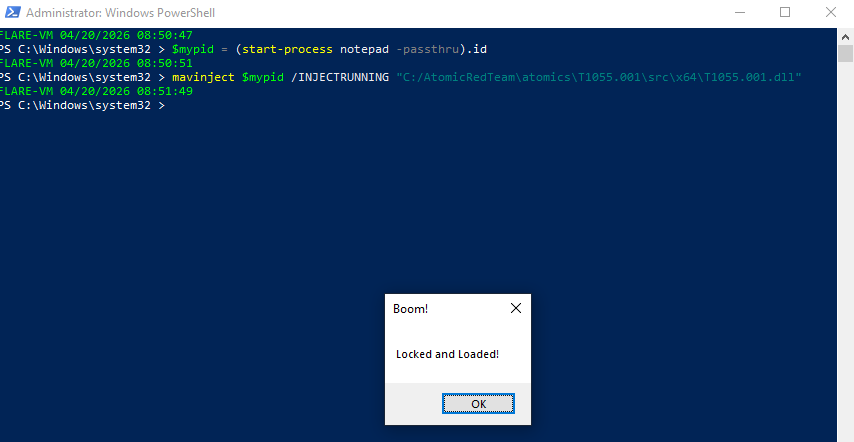
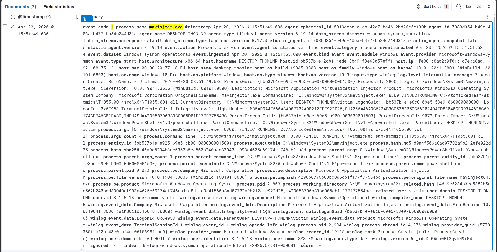
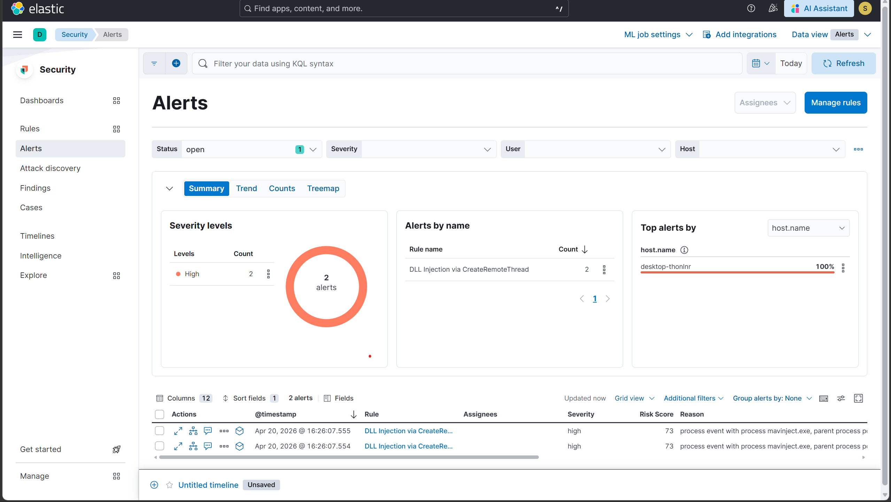

# Scenario 5 — T1055.001: DLL Injection via mavinject.exe

## Overview

| Field        | Value                                                    |
|--------------|----------------------------------------------------------|
| Technique    | T1055.001 — Process Injection: DLL Injection             |
| Atomic test  | Test #1 — Process Injection via mavinject.exe            |
| Internet     | Required (DLL payload downloaded from GitHub)            |
| Sysmon event | Event ID 1 (Process Creation)                            |
| Severity     | High                                                     |
| Result       | ✅ Detected                                              |

## What the attack does

The attacker uses mavinject.exe — a legitimate Windows binary (Microsoft
Application Virtualization Injector) — to inject a foreign DLL into a
running process (notepad.exe). The injected DLL executes within notepad's
memory space and security context, making the malicious code appear to
originate from a trusted Windows process. This technique is widely used
to evade process-based detection and to inherit the privileges of the
target process.

## How it was simulated

```powershell
# Step 1 — download DLL (internet required)
Invoke-AtomicTest T1055.001 -TestNumbers 1 -GetPreReqs

# Step 2 — disconnect internet, then run manually with sleep added
$mypid = (Start-Process notepad -PassThru).id
mavinject $mypid /INJECTRUNNING "C:\AtomicRedTeam\atomics\T1055.001\src\x64\T1055.001.dll"
Stop-Process -processname notepad
```

Proof of injection: a MessageBox appeared inside notepad.exe's process
space after the sleep was introduced.

## Detection signals observed

| Signal            | Details                                                          |
|-------------------|------------------------------------------------------------------|
| Sysmon Event ID 1 | mavinject.exe spawned by powershell.exe with /INJECTRUNNING arg  |
| ELK Alert         | Rule fired within 5 min of execution                             |

### Why there is no Event ID 8

Sysmon Event ID 8 (CreateRemoteThread) was **not observed** and will
never fire for mavinject.exe. Despite being an injector, mavinject
internally calls `NtCreateThreadEx` — an undocumented ntdll syscall —
directly, bypassing the `CreateRemoteThread` Win32 API that Sysmon hooks
for Event ID 8. This is one of the reasons mavinject is a useful LOLBin
for attackers: it evades the most common thread-injection detection
mechanism while remaining a signed, trusted Microsoft binary.

Event ID 1 on process creation is therefore the correct and sufficient
detection artifact for this technique.

## Detection rule (KQL)

```kql
event.code: "1" AND
process.name: "mavinject.exe" AND
process.command_line: *INJECTRUNNING* AND
NOT process.parent.executable: (
    "C:\\Windows\\System32\\msiexec.exe" OR
    "C:\\Windows\\System32\\AppVClient.exe" OR
    "C:\\Program Files\\Microsoft Application Virtualization\\*"
)
```

## Why this detection works

mavinject.exe is a legitimate App-V (Application Virtualization)
component. Its only valid parent processes in a real environment are
App-V infrastructure binaries. Any other parent — especially
powershell.exe, cmd.exe, or a user process — is inherently suspicious.
The `/INJECTRUNNING` flag in the command line confirms injection intent.

This behavioral rule requires no knowledge of the injected DLL's hash,
name, or origin. It catches mavinject misuse regardless of what payload
is delivered, making it resilient against payload variation.

In environments that do not use Microsoft App-V (including this lab),
the rule can be simplified with zero false positives:

```kql
event.code: "1" AND
process.name: "mavinject.exe" AND
process.command_line: *INJECTRUNNING*
```

## Evidence





## Detection score

> **Detected** — Sysmon Event ID 1 captured mavinject.exe spawned by
> powershell.exe with the /INJECTRUNNING flag targeting a foreign DLL.
> The custom ELK rule generated a High severity alert within 5 minutes
> of execution. Event ID 8 (CreateRemoteThread) was not observed as
> mavinject bypasses this API entirely, confirming that process creation
> argument-based detection is more reliable than thread-creation hooks
> for this specific LOLBin.

## Cleanup

```powershell
Invoke-AtomicTest T1055.001 -TestNumbers 1 -Cleanup
Stop-Process -Name notepad -ErrorAction SilentlyContinue
Test-Path "C:\AtomicRedTeam\atomics\T1055.001\src\x64\T1055.001.dll"
# Returns True — prereq DLL remains on disk by design, not a live threat
```

## References

- https://attack.mitre.org/techniques/T1055/001/
- https://github.com/redcanaryco/atomic-red-team/blob/master/atomics/T1055.001/T1055.001.md
- https://lolbas-project.github.io/lolbas/Binaries/Mavinject/