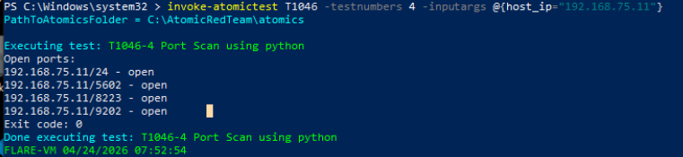
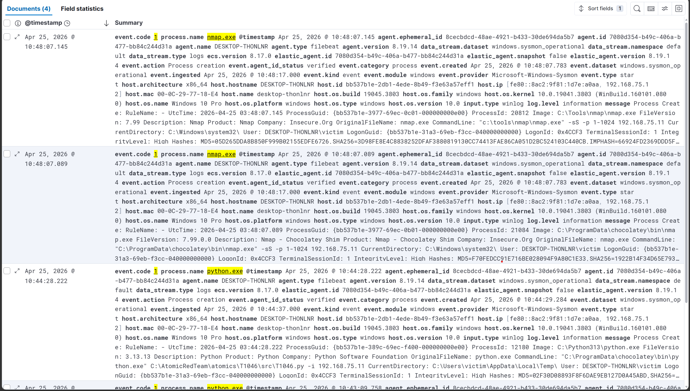
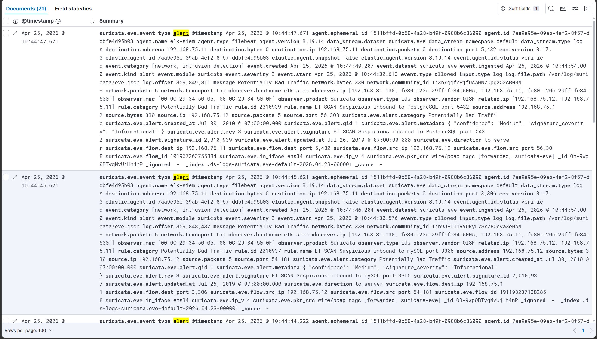
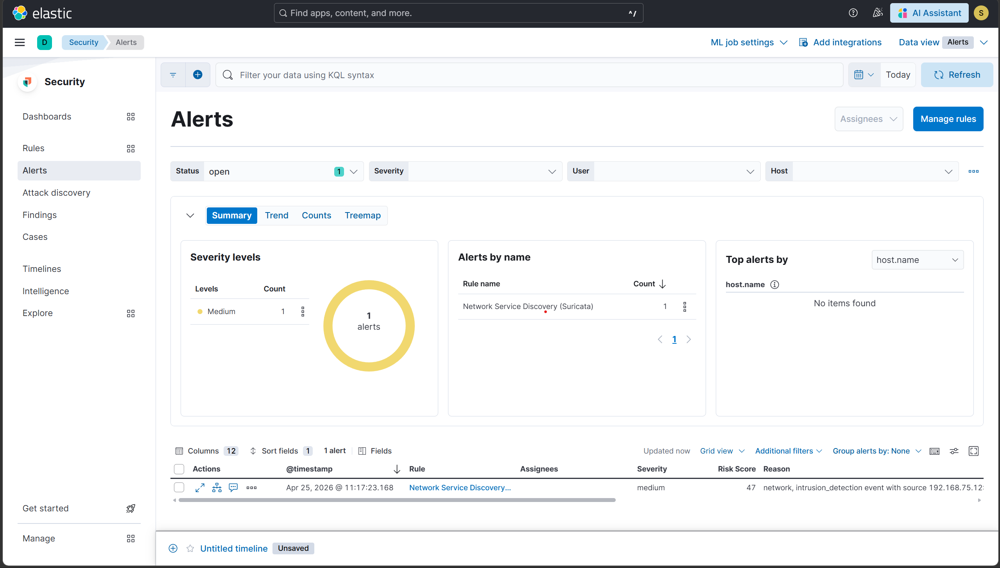

# Scenario 6 — T1046: Network Service Discovery

## Overview
| Field        | Value                                              |
|--------------|----------------------------------------------------|
| Technique    | T1046 — Network Service Discovery                  |
| Atomic test  | Python port scanner (Windows-supported test)       |
| Internet     | Required for GetPreReqs only (script download)     |
| Endpoint log | Sysmon Event ID 1 (process creation)               |
| Network log  | Suricata IDS — Emerging Threats scan signature     |
| Severity     | Medium                                             |
| Result       | ✅ Detected — dual-layer (endpoint + network)      |

## What the attack does
The attacker performs network reconnaissance by scanning open ports
on hosts in the target subnet. This is typically the first step
after initial access — discovering what services are running to
identify lateral movement targets and exploitation opportunities.
Two tools were used: the Atomic Red Team Python port scanner
(official Windows test) and nmap (available on FLARE-VM).

## How it was simulated
```powershell
# Official Atomic test (Windows-supported Python port scanner)
Invoke-AtomicTest T1046 -TestNumbers 4 -InputArgs @{host_ip="192.168.75.11"}

# Direct nmap scan for stronger Suricata signature
nmap -sT -p 1-1024 192.168.75.11
```
Proof of execution: open ports on ELK server (9200, 5601, 22)
returned by both tools.

## Why this scenario is unique — dual-layer detection
This is the first scenario in the lab where the same attack is
caught simultaneously by two independent detection systems:

1. **Sysmon Event ID 1 (endpoint layer)** — caught python.exe and
   nmap.exe being launched with the target IP in the command line
2. **Suricata IDS (network layer)** — caught the actual scan
   packets hitting ens34, matching Emerging Threats signatures

An attacker who somehow bypassed Sysmon (e.g. by using a renamed
binary) would still be caught by Suricata on the wire. An attacker
who somehow evaded Suricata would still be caught by Sysmon.
This is defence-in-depth detection in practice.

## Detection signals observed
| Signal                    | Details                                       |
|---------------------------|-----------------------------------------------|
| Sysmon Event ID 1         | python.exe / nmap.exe with 192.168.75.11 arg  |
| Suricata alert.signature  | ET SCAN signature from Emerging Threats rules |
| src_ip                    | 192.168.75.10 (FLARE-VM attacker)             |
| dest_ip                   | 192.168.75.11 (ELK server target)             |
| ELK Alert                 | Rule fired within 5 min of scan               |

## Detection rule (KQL)
```
event.module: "suricata" AND 
event.kind: "alert" AND 
rule.name: *SCAN*
```

## Evidence






## Detection score
> **Detected** — both Sysmon Event ID 1 (endpoint) and Suricata IDS
> (network) independently captured the scan. The ELK rule generated
> a Medium severity alert within 5 minutes of execution.

## References
- https://attack.mitre.org/techniques/T1046/
- https://github.com/redcanaryco/atomic-red-team/blob/master/atomics/T1046/T1046.md
- https://suricata.io/
- https://rules.emergingthreats.net/