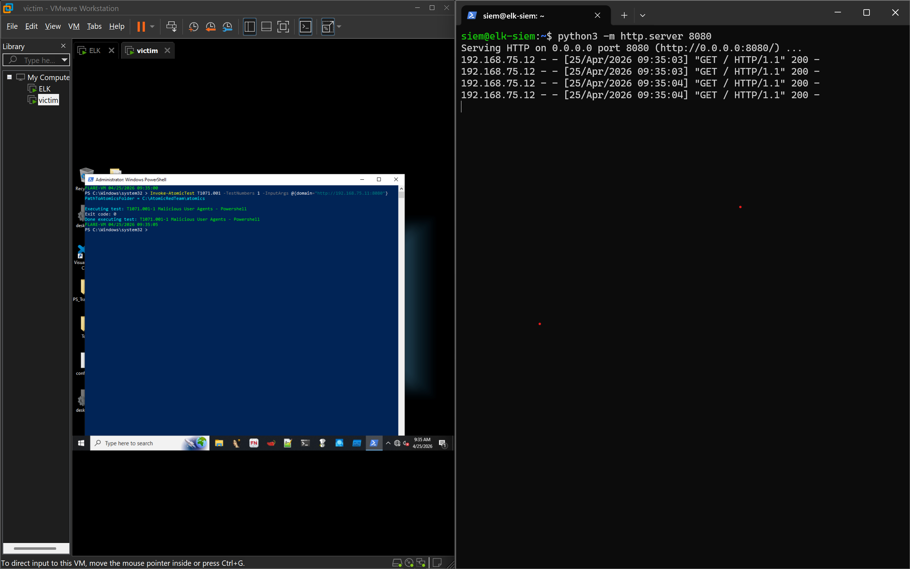
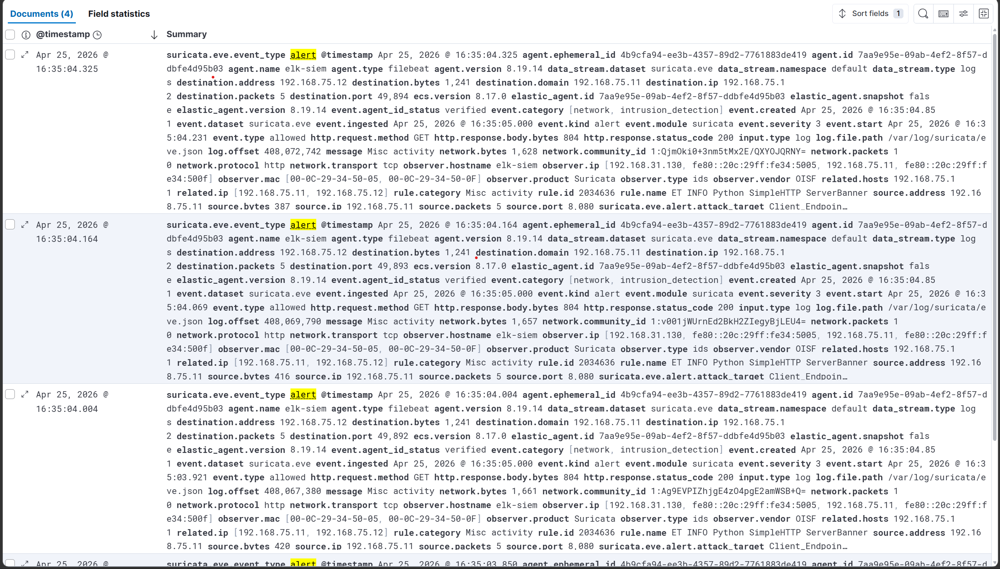
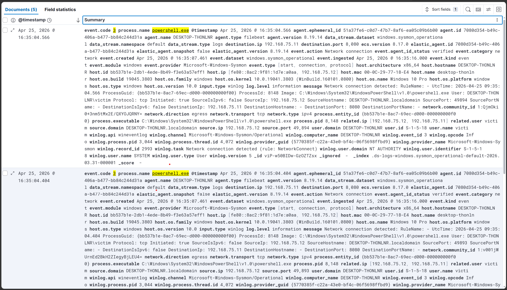
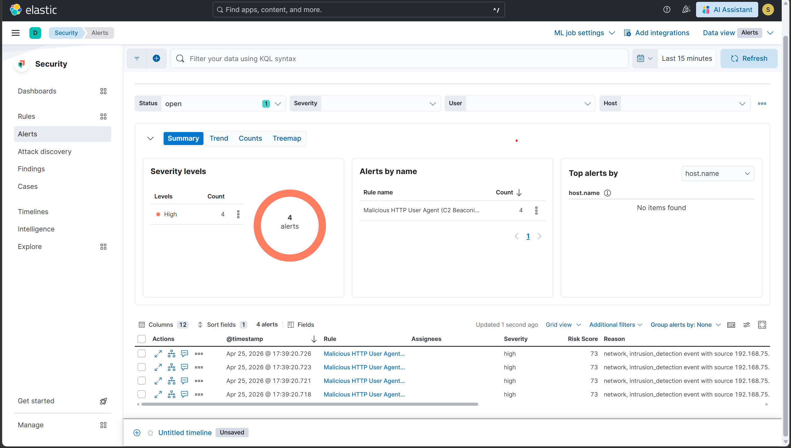

# Scenario 7 — T1071.001: C2 Beaconing via Malicious HTTP User Agents

## Overview
| Field        | Value                                                    |
|--------------|----------------------------------------------------------|
| Technique    | T1071.001 — Application Layer Protocol: Web Protocols    |
| Atomic test  | Test #1 — Malicious User Agents — PowerShell             |
| Internet     | Not required                                             |
| Endpoint log | Sysmon Event ID 3 (NetworkConnect — powershell.exe)      |
| Network log  | Suricata IDS — malicious HTTP user agent signature       |
| Severity     | High                                                     |
| Result       | ✅ Detected                                              |

## What the attack does
An infected host uses PowerShell's Invoke-WebRequest to send HTTP
requests to a C2 server, disguising the traffic with known-malicious
user agent strings associated with real APT malware families:

- HttpBrowser/1.0 — used by APT1 malware family
- Wget/1.9+cvs-stable (Red Hat modified) — known C2 tool
- Opera/8.81 (Windows NT 6.0; U; en) — outdated/spoofed browser string
- *<|>* — malformed agent string common in commodity malware

Unlike port scanning (T1046), active C2 beaconing means the machine
is already compromised and communicating with an attacker-controlled
server — the highest priority for a SOC to investigate.

## How it was simulated

A Python HTTP server was started on the ELK server (192.168.75.11:8080)
to act as the C2 listener. The Atomic test was then pointed at this
internal listener instead of the default external domain, keeping the
simulation fully offline:

```powershell
# On ELK server (SSH):
python3 -m http.server 8080 &

# On FLARE-VM:
Invoke-AtomicTest T1071.001 -TestNumbers 1 -InputArgs @{domain="http://192.168.75.11:8080"}
```

Proof of execution: 4 HTTP GET requests from 192.168.75.10 visible
in the Python HTTP server output on the ELK server.

## Why Sysmon Event ID 3 (not ID 1)
The test does not spawn a child process — PowerShell makes the web
request directly using .NET's WebClient. This means no process
creation event fires (Event ID 1). Event ID 3 (NetworkConnect)
captures the outbound connection from the existing PowerShell process.
This is an important real-world nuance: not all C2 techniques generate
a process creation event, so relying solely on Event ID 1 would miss this.

## Detection signals observed
| Signal                            | Details                                       |
|-----------------------------------|-----------------------------------------------|
| Suricata alert / HTTP flow        | Malicious user agent strings in HTTP headers  |
| suricata.eve.http.http_user_agent | HttpBrowser/1.0, Wget/1.9+cvs, etc.           |
| Sysmon Event ID 3                 | powershell.exe → 192.168.75.11:8080 outbound  |
| ELK Alert                         | High severity rule fired within 5 min         |

## Detection rule (KQL)
```
event.module: "suricata" AND
event.kind: "alert" AND
(
  (
    network.protocol: "http" AND
    user_agent.original: (
      *HttpBrowser* OR "*<|>*" OR *Wget/1.9+cvs* OR
      *Opera/8.81* OR "python-requests*" OR "Go-http-client*"
    )
  ) OR
  rule.category: (
    "A Network Trojan was detected" OR
    "Malware Command and Control Activity Detected"
  ) OR
  rule.name: (*MALWARE* OR *Trojan* OR *CnC* OR *C2* OR *Beacon* OR *RAT* OR *Backdoor*)
)
```

## Evidence





## Detection score
> **Detected** — Suricata identified the malicious HTTP user agent
> strings at the network level, and Sysmon Event ID 3 captured the
> outbound PowerShell connection at the endpoint level. The custom
> ELK rule generated a High severity alert within 5 minutes.

## Cleanup
```bash
# On ELK server — stop the Python HTTP listener:
kill $(lsof -t -i:8080)
```

## References
- https://attack.mitre.org/techniques/T1071/001/
- https://github.com/redcanaryco/atomic-red-team/blob/master/atomics/T1071.001/T1071.001.md
- https://github.com/NextronSystems/APTSimulator