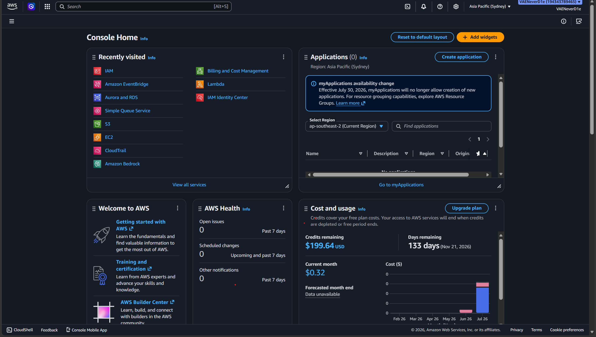
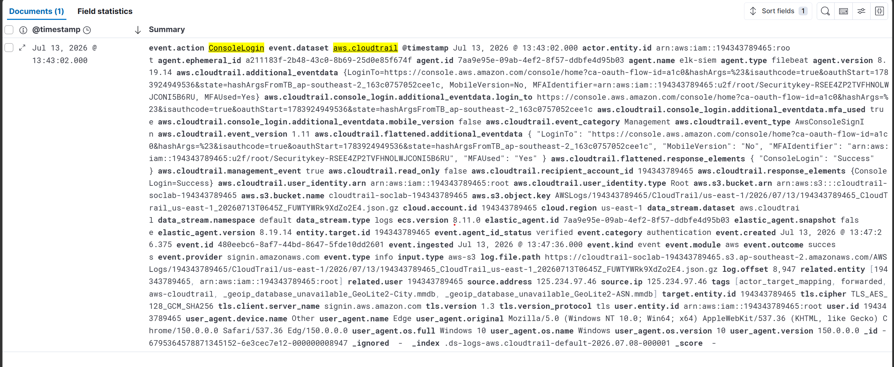
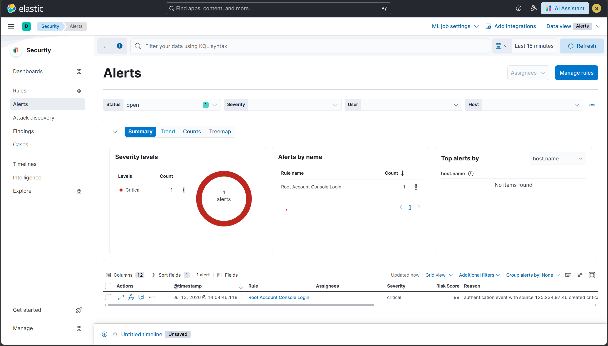

# Scenario 8 — T1078.004: Root Account Console Login

## Overview
| Field        | Value                                               |
|--------------|-----------------------------------------------------|
| Technique    | T1078.004 — Valid Accounts: Cloud Accounts          |
| Simulation   | Manual root console login (AWS Management Console)  |
| Internet     | Required (AWS console access)                       |
| CloudTrail   | ConsoleLogin event                                  |
| Severity     | Critical                                            |
| Result       | ✅ Detected                                         |

## What the attack does
A root account login represents the highest-privilege access path
into an AWS account. Root has no permission boundary and cannot be
restricted by IAM policy, so any adversary who obtains root
credentials has unconditional control of every resource in the
account. Legitimate operations should almost never require root —
day-to-day work is done through scoped IAM users or roles. A root
console login is therefore treated as a high-signal event worth
alerting on regardless of context.

## How it was simulated
Signed out of all IAM sessions, then logged into the AWS
Management Console as the root user (email + password + MFA),
and logged out immediately after.

Proof of execution: root login recorded in CloudTrail as a
ConsoleLogin event with aws.cloudtrail.user_identity.type: "Root".

## Detection signals observed
| Signal                               | Details                                 |
|--------------------------------------|-----------------------------------------|
| event.action                         | ConsoleLogin                            |
| aws.cloudtrail.user_identity.type    | Root                                    |
| event.outcome                        | success                                 |
| ELK Alert                            | Rule fired within [fill in] minutes     |

## Detection rule (KQL)
```
event.dataset: "aws.cloudtrail" AND
event.action: "ConsoleLogin" AND
aws.cloudtrail.user_identity.type: "Root" AND
event.outcome: "success"
```

## Why this detection works
The rule keys on the identity type rather than any specific user
or IP, so it fires on any root login regardless of source —
whether from a legitimate emergency access scenario or a
compromised credential. No exclusions are applied: in this lab
account, root login is never expected routine behavior, so the
rule stays maximally sensitive.

## Evidence




## Detection score
> **Detected** — CloudTrail captured the ConsoleLogin event with
> user_identity.type: Root, and the custom ELK rule generated a
> Critical severity alert within 2 minutes of login.

## References
- https://attack.mitre.org/techniques/T1078/004/
- https://docs.aws.amazon.com/awscloudtrail/latest/userguide/cloudtrail-event-reference-user-identity.html