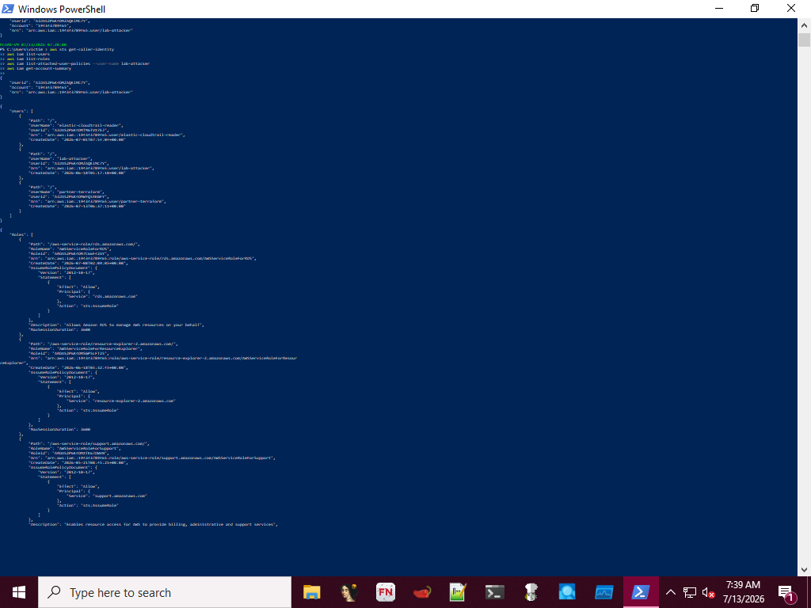
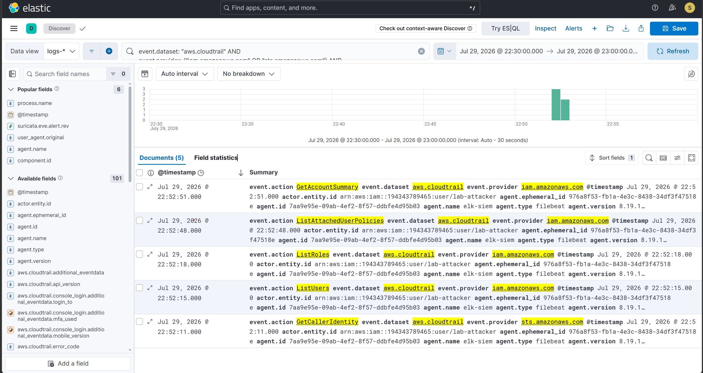
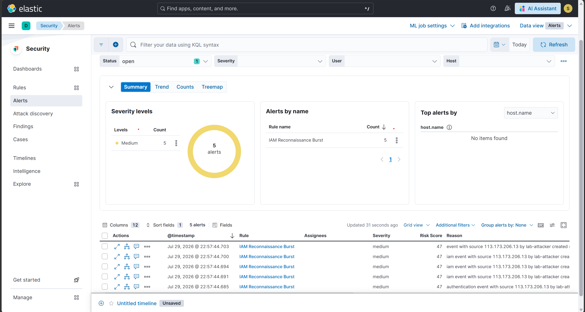

# Scenario 9 — T1078.004: IAM Reconnaissance Burst

## Overview
| Field        | Value                                               |
|--------------|-----------------------------------------------------|
| Technique    | T1078.004 — Valid Accounts: Cloud Accounts          |
| Simulation   | AWS CLI — burst of IAM read calls                   |
| Internet     | Required (AWS API calls)                            |
| CloudTrail   | ListUsers, ListRoles, ListAttachedUserPolicies,     |
|              | GetAccountSummary, GetCallerIdentity                |
| Severity     | Medium                                              |
| Result       | ✅ Detected                                         |

## What the attack does
After gaining a foothold with valid credentials, an adversary
typically enumerates the account's IAM configuration before
deciding on a next move — who else exists, what roles are
available, and what permissions the current identity actually
holds. Individually, each of these API calls is a normal
administrative action. What makes this reconnaissance is the
pattern: several distinct read calls fired in rapid succession
from a single identity, consistent with automated enumeration
rather than a human checking one thing.

## How it was simulated
```bash
aws sts get-caller-identity
aws iam list-users
aws iam list-roles
aws iam list-attached-user-policies --user-name lab-attacker
aws iam get-account-summary
```
Proof of execution: 5 CloudTrail events recorded from the
lab-attacker identity within 1 second of each other.

## Detection signals observed
| Signal                              | Details                                 |
|-------------------------------------|-----------------------------------------|
| event.provider                      | iam.amazonaws.com                       |
| event.action                        | 5 distinct read actions                 |
| aws.cloudtrail.user_identity.arn    | lab-attacker                            |
| Burst window                        | 1 second, 5 calls                       |
| ELK Alert                           | Rule fired within 5 minutes             |

## Detection rule (KQL)
```
event.dataset: "aws.cloudtrail" AND
event.provider: ("iam.amazonaws.com" OR "sts.amazonaws.com") AND
event.action: (
  "ListUsers" OR "ListRoles" OR "ListAttachedUserPolicies" OR
  "ListPolicies" OR "GetAccountSummary" OR "GetCallerIdentity"
) AND
NOT aws.cloudtrail.user_identity.arn: "*elastic-cloudtrail-reader*"
```

## Detection strategy note
This rule matches on the individual read actions rather than
enforcing the burst pattern itself — the tight timing observed
(5 calls in 21 seconds) was confirmed manually in Kibana
Discover rather than encoded into the rule logic. A production
version of this detection would use a Threshold rule type,
grouping by aws.cloudtrail.user_identity.arn and alerting when a
single identity crosses a count threshold of distinct IAM read
actions within a short window — the same approach used for the
S3 bulk-download detection in Scenario 11. Documenting this
distinction here rather than overstating the rule's precision.

## Why this detection works
The rule excludes the elastic-cloudtrail-reader service account,
which legitimately calls some of these same read APIs as part of
normal Elastic Agent operation. Without that exclusion the rule
would self-alert on the SIEM's own plumbing.

## Evidence




## Detection score
> **Detected** — CloudTrail captured all 5 IAM read calls from
> the lab-attacker identity within a 21-second window, and
> the custom ELK rule generated a Medium severity alert within
> 5 minutes.

## References
- https://attack.mitre.org/techniques/T1078/004/
- https://docs.aws.amazon.com/IAM/latest/UserGuide/id_credentials_temp_request.html