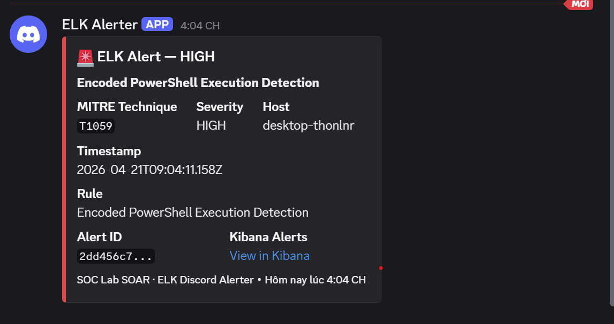

# SOAR — ELK → Discord Alerter

Polls Elastic Security every 60 seconds for new High/Critical
alerts and forwards them to Discord via webhook embed.

## Architecture
```
FLARE-VM (attack) → Sysmon → Elastic Agent → ELK SIEM
                                                  ↓
                                    elk_discord_alerter.py (host)
                                                  ↓
                                         Discord webhook
```

## Requirements
- Python 3.8+
- pip install requests
- Kibana reachable from host machine

## Setup
### 1. Create Discord webhook
Discord → channel → Edit Channel → Integrations → Webhooks → New

### 2. Create ELK API key
Kibana → Stack Management → API Keys → Create API Key

### 3. Set environment variables
```bash
# Windows PowerShell:
$env:DISCORD_WEBHOOK = "https://discord.com/api/webhooks/..."
$env:ELK_API_KEY     = "your_api_key_here"
$env:ELK_URL         = "http://192.168.31.130:5601"
```

## Usage
```bash
python elk_discord_alerter.py --test   # test connections
python elk_discord_alerter.py          # run polling mode
```

## What each Discord alert contains
| Field        | Example                      |
|--------------|------------------------------|
| MITRE ID     | T1547.001                    |
| Name         | Registry Run Key Persistence |
| Severity     | MEDIUM                       |
| Host         | FLARE-VM                     |
| Timestamp    | 2026-04-18T14:35:22Z         |
| Kibana link  | Direct link to alert         |

## Evidence

