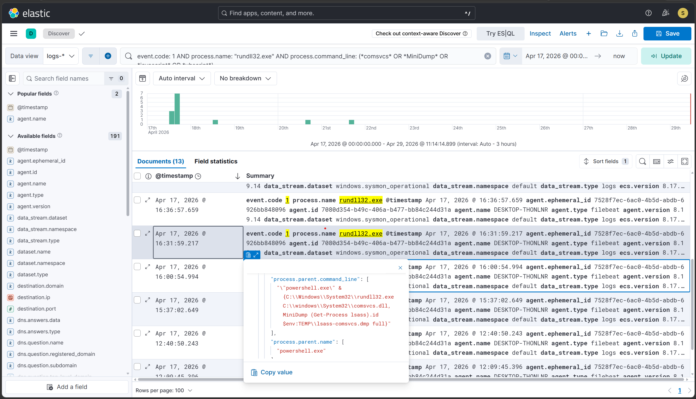
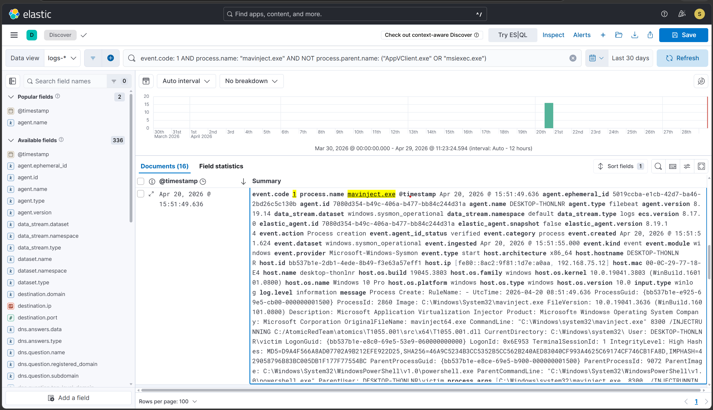
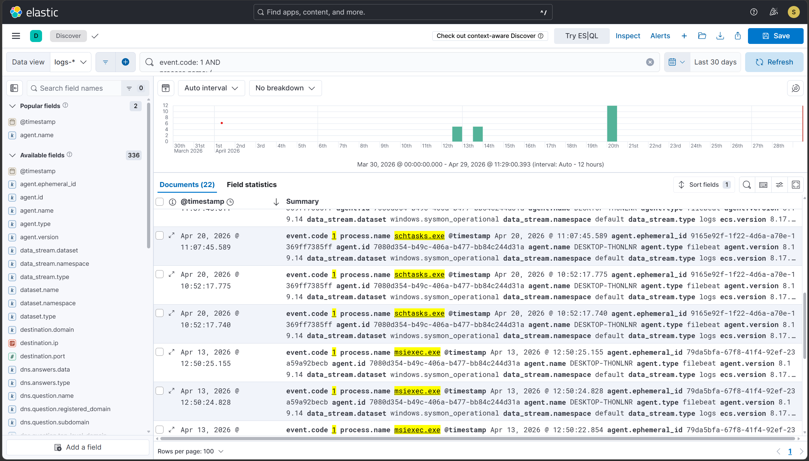
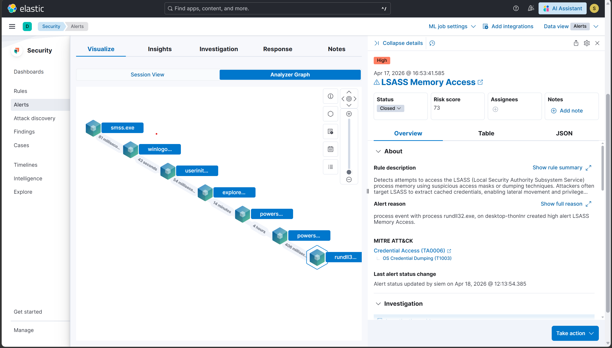
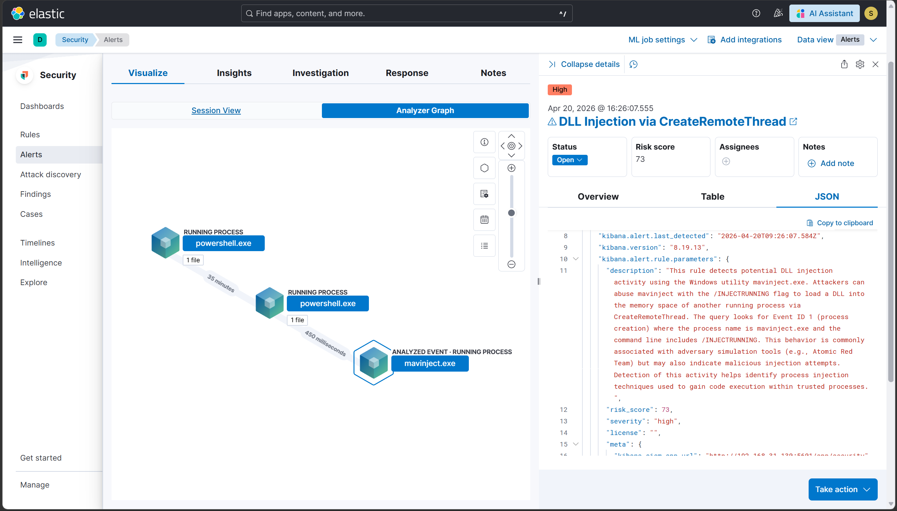

# Hunt 1 — LOLBin Abuse: Suspicious Use of Trusted Windows Binaries

## Hypothesis
An attacker on this network may have used legitimate Windows binaries
(LOLBins) to execute malicious actions — evading detection tools that
look for known malware executables rather than the behavior of trusted
system tools.

## Trigger
Inspired by T1003.001 scenario where rundll32.exe + comsvcs.dll was
used to dump LSASS memory — a classic LOLBin technique. Hypothesis:
are there other LOLBin executions in the lab data that went unnoticed?

## Data sources queried
- Sysmon Event ID 1 (Process Creation) — logs-* index
- Time range: Last 30 Days
- Host: FLARE-VM (192.168.75.12)

## Hunt queries run

### 1a — rundll32.exe with suspicious arguments
```
event.code: 1 AND
process.name: "rundll32.exe" AND
process.command_line: (*comsvcs* OR *MiniDump* OR *javascript* OR *vbscript*)
```
**Results:** [13 events]

### 1b — mavinject.exe outside App-V context
```
event.code: 1 AND
process.name: "mavinject.exe" AND
NOT process.parent.name: ("AppVClient.exe" OR "msiexec.exe")
```
**Results:** [16 events]

### 1c — Broad LOLBin baseline
```
event.code: 1 AND
process.name: ("mshta.exe" OR "wscript.exe" OR "cscript.exe" OR
  "regsvr32.exe" OR "certutil.exe" OR "bitsadmin.exe" OR
  "installutil.exe" OR "schtasks.exe" OR "msiexec.exe")
```
**Results:** [22 events]

### 1d — Unusual parent-child chains
```
event.code: 1 AND
process.parent.name: "powershell.exe" AND
process.name: ("rundll32.exe" OR "mshta.exe" OR "regsvr32.exe" OR "mavinject.exe")
```
**Results:** [29 events]

## Findings

### ✅ Confirmed malicious — Hunt 1a
**rundll32.exe → comsvcs.dll → MiniDump on lsass.exe**
- Timestamp: Apr 17, 2026 @ 16:00:54.994
- Command line: `rundll32.exe C:\Windows\System32\comsvcs.dll MiniDump [PID] [output] full`
- Parent process: powershell.exe
- Detection rule: T1003.001 rule already covers this — alert fired
- Verdict: **Covered by existing detection**

### ✅ Confirmed malicious — Hunt 1b
**mavinject.exe spawned by powershell.exe with /INJECTRUNNING**
- Timestamp: Apr 20, 2026 @ 15:51:49.636
- Command line: `mavinject.exe [PID] /INJECTRUNNING [DLL path]`
- Parent process: powershell.exe (NOT a legitimate App-V parent)
- Detection rule: T1055.001 rule already covers this — alert fired
- Verdict: **Covered by existing detection**

### 🔍 Investigated and benign — Hunt 1c (schtasks.exe)
- schtasks.exe appeared in results from T1053.005 test
- Command line contains /create with onlogon/onstart triggers
- Already covered by T1053.005 detection rule
- Verdict: **Expected, covered**

### 🔍 Investigated and benign — Hunt 1c (msiexec.exe)
- **Timestamp:** 2026-04-13 05:50:24
- **Event:** `msiexec.exe` spawned by `msiexec.exe /V`
- **Command Line:** `msiexec.exe -Embedding F8269910B... Global\MSI0000`
- **Analysis:** The `-Embedding` flag indicates a standard DCOM activation for a background Windows installation/update running as SYSTEM. No remote payloads or suspicious parameters were present.
- **Verdict:** Expected, benign background noise.

### ⬜ No evidence — Hunt 1c (gap LOLBins)
- mshta.exe: 0 results
- certutil.exe: 0 results
- bitsadmin.exe: 0 results
- regsvr32.exe: 0 results
- Verdict: **Not present in lab data — common real-world LOLBins
  not yet simulated. Identified as future work.**

## Conclusion
**Hypothesis confirmed.** LOLBin abuse was present in lab data:
rundll32.exe (T1003.001) and mavinject.exe (T1055.001) were both
identified. Both findings were already covered by existing detection
rules, validating rule coverage for these specific techniques.

Gap identified: mshta.exe, certutil.exe, and bitsadmin.exe are
high-value LOLBins with no lab coverage — candidates for future
atomic test scenarios.

## Detection gaps identified
None requiring immediate new rules. Existing T1003.001 and T1055.001
rules provide coverage. Future lab iterations should add:
- T1218.005 (mshta.exe abuse)
- T1140 (certutil.exe for decode/download)

## Time to hunt
Approximately 45 minutes

## Evidence





