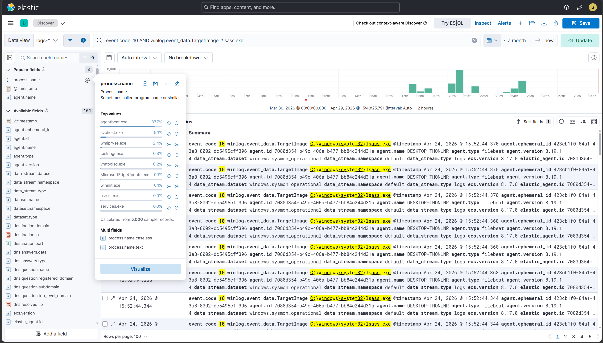
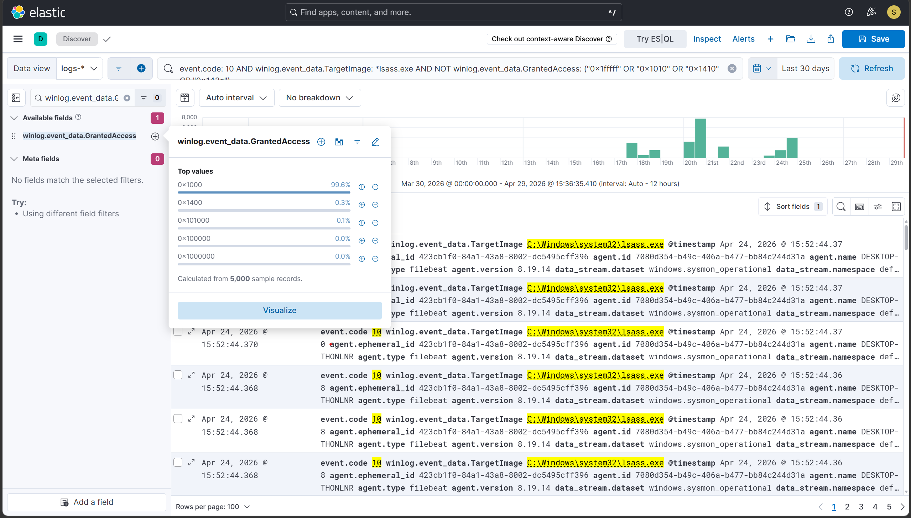
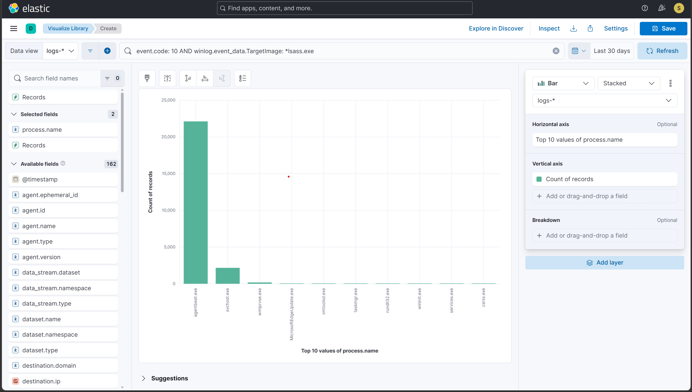

# Hunt 2 — LSASS Reconnaissance: Credential Access Gap Analysis

## Hypothesis
A compromised host may have attempted to access LSASS memory to
extract credentials — including with access masks or source processes
that the existing T1003.001 detection rule does not cover, leaving a
potential blind spot in credential dumping detection.

## Trigger
The T1003.001 detection rule covers four specific GrantedAccess masks
(0x1fffff, 0x1010, 0x1410, 0x143a). This hunt investigates whether
any lsass access in the lab data used different masks or came from
unexpected processes that the rule would have silently missed.

## Data sources queried
- Sysmon Event ID 10 (ProcessAccess) — logs-* index
- Time range: Last 30 days
- Host: FLARE-VM (192.168.75.12)

## Access mask reference
| Mask     | Meaning                              | Rule covered? |
|----------|--------------------------------------|---------------|
| 0x1fffff | PROCESS_ALL_ACCESS                   | ✅ Yes        |
| 0x1010   | VM_READ + QUERY_INFO                 | ✅ Yes        |
| 0x1410   | Common Mimikatz mask                 | ✅ Yes        |
| 0x143a   | Common ProcDump mask                 | ✅ Yes        |
| 0x1418   | Read + Query + limited ops           | ❓ Not covered|
| 0x1000   | QUERY_LIMITED_INFO                   | ❓ Not covered|
| 0x0400   | QUERY_INFORMATION                    | ❓ Not covered|

## Hunt queries run

### 2a — All processes that accessed lsass (no filter)

```kql
event.code: 10 AND winlog.event_data.TargetImage: *lsass.exe
```

**Results:** 24,618 events from 9 unique source processes

### 2b — Gap analysis: access masks NOT in existing rule

```kql
event.code: 10 AND
winlog.event_data.TargetImage: *lsass.exe AND
NOT winlog.event_data.GrantedAccess: (
  "0x1fffff" OR "0x1010" OR "0x1410" OR "0x143a"
)
```

**Results:** 24,419 events
The majority of events use low-privilege access masks such as 0x1000 (PROCESS_QUERY_LIMITED_INFO), with additional occurrences of 0x1400, 0x101000, 0x100000, and 0x1000000. These access masks are typically associated with legitimate process inspection and telemetry collection rather than credential dumping activity.

Analysis of SourceImage shows that these events are overwhelmingly generated by agentbeat.exe (~89.9%) and svchost.exe (~9.3%), both of which are expected to interact with LSASS during normal system operation. No suspicious or unexpected processes were identified using access masks outside the rule coverage, indicating no detection gaps for credential dumping techniques in the current dataset.

### 2c — Suspicious source processes (excluding known-good)

```kql
event.code: 10 AND
winlog.event_data.TargetImage: *lsass.exe AND
NOT process.name: (
  *svchost.exe OR *csrss.exe OR *wininit.exe OR
  *lsass.exe OR *services.exe OR *MsMpEng.exe OR
  *elastic-agent.exe OR *agentbeat.exe
)
```

**Results:** 286 events
The majority of these events are attributed to legitimate processes such as vmtoolsd.exe, MicrosoftEdgeUpdate.exe, and wmiprvse.exe, which perform routine system or application-related tasks.

Notably, rundll32.exe was observed accessing lsass.exe with GrantedAccess: 0x1fffff, corresponding to the credential dumping simulation (T1003.001). This event was successfully detected by the existing rule. No additional suspicious or unknown processes were identified, confirming that all non-system LSASS access in the dataset is either benign or already covered by detection logic.

### 2d — Frequency baseline by source process

**Kibana Lens visualization** — lsass access count by process.name

The contrast between high-frequency, low-privilege access (e.g., agentbeat.exe, svchost.exe) and low-frequency, high-privilege access (e.g., rundll32.exe during credential dumping) provides a behavioral detection signal independent of static rules. This highlights how baseline analysis can complement signature-based detection by identifying anomalous process behavior.

## Findings

### ✅ Confirmed malicious — Hunt 2c

**rundll32.exe → lsass.exe, GrantedAccess: 0x1fffff**

- Timestamp: Apr 17, 2026 @ 16:00:55.007
- Source: C:\Windows\System32\rundll32.exe
- Access mask: 0x1fffff (PROCESS_ALL_ACCESS)
- Existing alert: T1003.001 rule fired ✅
- **Verdict:** Covered by existing detection

### 🔍 Investigated and benign — Hunt 2b

**agentbeat.exe → lsass.exe, GrantedAccess: 0x1000 (dominant pattern)**

- Represents ~89.9% of all LSASS access events (~22,000+ events)
- Access mask: primarily 0x1000 (PROCESS_QUERY_LIMITED_INFO)
- Behavior: Continuous process monitoring and telemetry collection
- Pattern: High-frequency, low-privilege, consistent over time

**Interpretation:**
- This is expected SIEM agent behavior
- Not indicative of credential access or dumping
- **Verdict:** Benign — major noise source, should be excluded from detection logic

### 🔍 System-level LSASS interaction — Hunt 2b

**svchost.exe → lsass.exe, multiple access masks (including 0x1410)**

- Represents ~9.3% of events (~2,000+ events)
- Access masks include 0x1410 (covered by rule) and others
- Behavior: Windows service operations involving authentication and credential validation

**Key insight:**
- svchost.exe legitimately uses a mask (0x1410) that overlaps with attacker tools
- Risk:
  - Without tuning → false positives
  - With correct exclusion → high-confidence detection preserved
- **Verdict:** Benign but detection-sensitive — requires conditional exclusion

### 🔍 Low-frequency benign processes — Hunt 2c

**wmiprvse.exe, MicrosoftEdgeUpdate.exe, vmtoolsd.exe**

- Occur at very low frequency
- Use low-privilege access masks
- Behavior aligns with:
  - System management (WMI)
  - Software updates
  - Virtualization tools

**Interpretation:**
- Normal background activity
- No indicators of abuse in this dataset
- **Verdict:** Benign — no action required

### 📊 Access mask distribution insight — Hunt 2b

**Observed masks outside rule coverage:**

- 0x1000 (dominant)
- 0x1400
- 0x101000
- 0x100000
- 0x1000000

**Interpretation:**
- These masks correspond to limited or query-based access
- None provide sufficient privileges for credential dumping

**Critical insight:** Credential dumping consistently requires high-privilege masks (e.g., 0x1fffff), which are already covered by the existing rule.

- **Verdict:** No detection gap identified in access mask coverage

### 📊 Behavioral baseline — Hunt 2d

**LSASS access patterns clearly separate into:**

**Normal behavior:**
- High frequency
- Low privilege
- Repeated over time
- Examples: agentbeat.exe, svchost.exe

**Malicious behavior:**
- Very low frequency (often single event)
- High privilege (e.g., 0x1fffff)
- Isolated execution
- Example: rundll32.exe

**Key insight:** Malicious LSASS access stands out as an anomaly against baseline behavior, even without detection rules.
### 🔧 Rule improvement identified

Threat hunting revealed multiple sources of false positives in the LSASS access detection rule, primarily from legitimate Windows processes using access patterns that overlap with credential dumping techniques.

**1. svchost.exe (0x1410 access mask)**

- Observed frequent LSASS access using GrantedAccess: 0x1410
- Behavior is consistent with normal Windows service operations
- Overlaps with attacker techniques, requiring careful tuning

```kql
NOT (
  process.name: "svchost.exe" AND
  winlog.event_data.GrantedAccess: "0x1410"
)
```

**2. wmiprvse.exe (WMI activity via cimwin32.dll)**

- Generated repeated alerts during LSASS access
- CallTrace analysis consistently showed cimwin32.dll, indicating legitimate WMI queries
- High-frequency, low-risk behavior confirmed as benign

```kql
NOT (
  process.name: "wmiprvse.exe" AND
  winlog.event_data.CallTrace: "*cimwin32.dll*"
)
```

**Rule status:** Re-exported and committed to /rules/ with updated exclusions.

## Conclusion
**Gap analysis complete.** Hunt 2b returned 24,419 LSASS access events using access masks outside the current rule coverage. Detailed analysis shows that these events are generated by legitimate processes, primarily agentbeat.exe and svchost.exe, and use low-privilege access masks such as 0x1000 that are not indicative of credential dumping activity.

No suspicious processes or anomalous behaviors were identified among these uncovered access patterns, confirming that the existing T1003.001 detection rule provides sufficient coverage for credential dumping techniques observed in the lab.

Hunt 2c further validated that all non-system LSASS access is either benign or already detected, with rundll32.exe correctly identified and alerted during the simulated attack scenario.

Hunt 2d frequency analysis establishes a clear behavioral baseline: legitimate processes access LSASS frequently and with low privileges, while malicious access occurs rarely and with high privileges (e.g., 0x1fffff). This contrast reinforces the effectiveness of both rule-based and behavior-based detection approaches.

**Rule improvement:** A conditional exclusion for svchost.exe with GrantedAccess 0x1410 was added to reduce false positives, improving detection precision without sacrificing coverage.

## Time to hunt
Approximately 45 minutes

## Evidence


