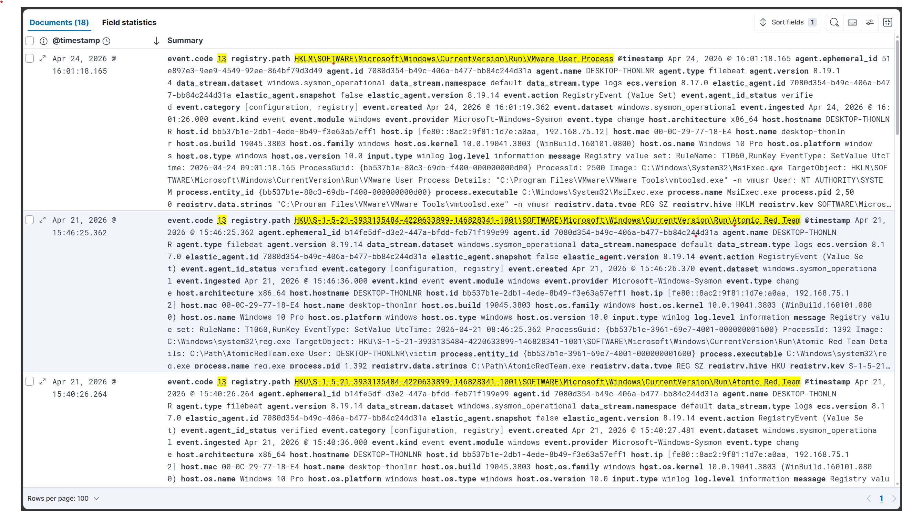
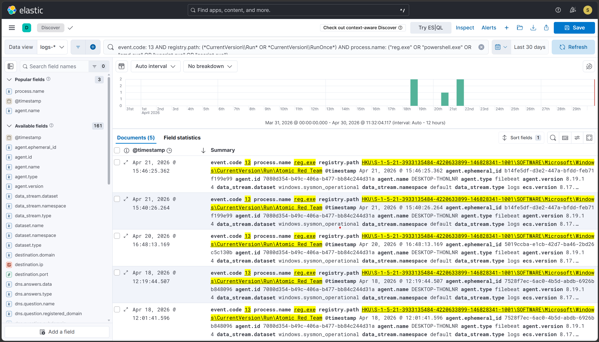
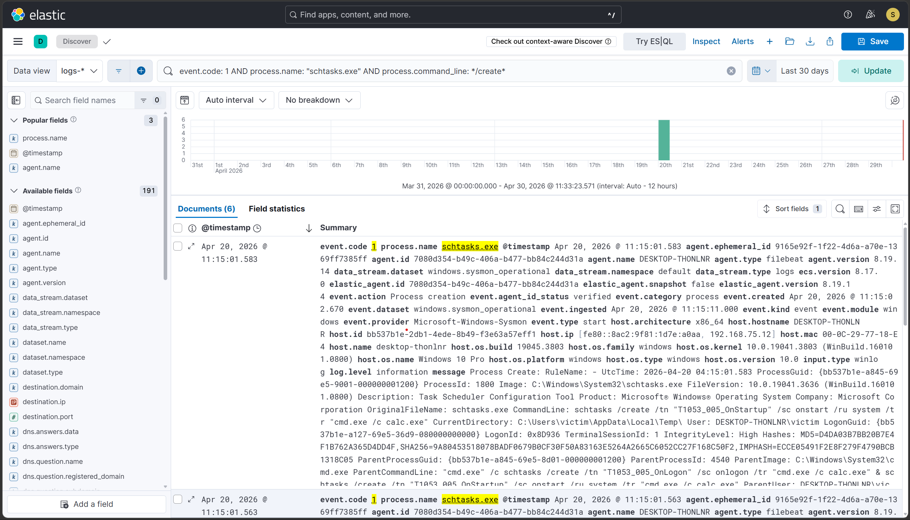
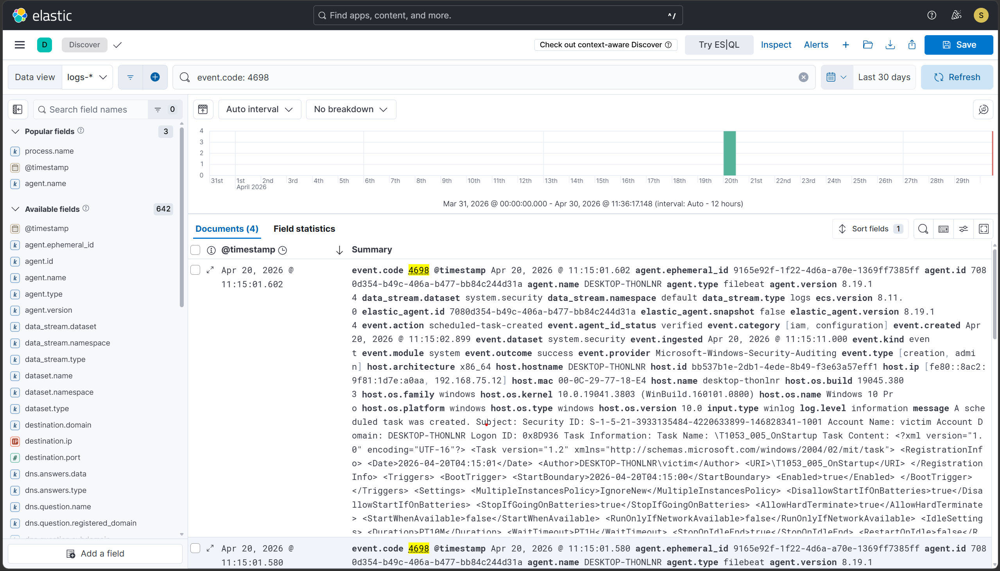
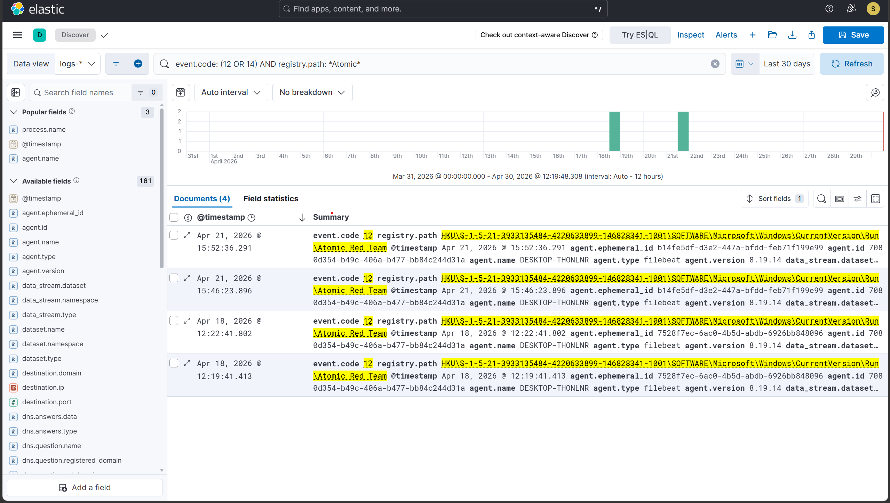
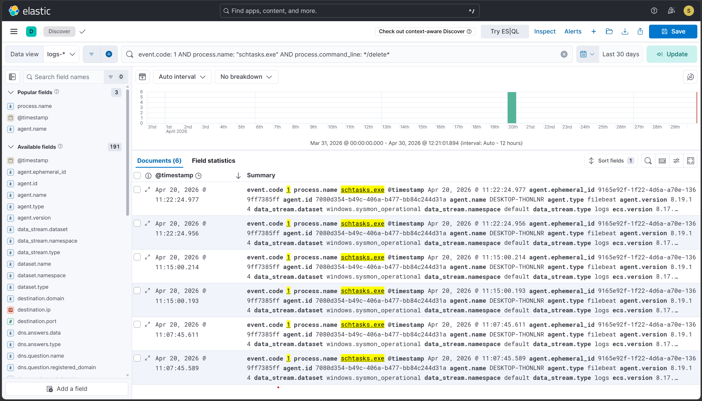

# Hunt 3 — Persistence Audit: Verifying Cleanup of Run Keys and Scheduled Tasks

## Hypothesis
Persistence artifacts planted during attack simulations — registry
Run keys and scheduled tasks — may still be present on the system
post-cleanup, either because cleanup failed silently or because
additional persistence mechanisms were created that were not
explicitly tracked.

## Trigger
Two persistence scenarios were executed in the lab (T1547.001 and T1053.005). This hunt audits the SIEM record of both persistence techniques, verifying their complete lifecycle from creation to deletion, and validates the lab's remediation methodology.

## Lab remediation context
A defense-in-depth approach to remediation was utilized for this lab:
- **Scripted OS-level cleanup** — Atomic Red Team -Cleanup commands were executed to actively remove the artifacts. This generates vital forensic logs (deletion events) for the SIEM to ingest, demonstrating what remediation looks like in telemetry.
- **Hypervisor-level snapshot reversion** — FLARE-VM was subsequently reverted to a named pre-test snapshot ("clean" state). This serves as a fail-safe, guaranteeing complete OS state restoration in case the cleanup scripts failed silently or missed secondary artifacts.

This two-layered approach ensures both complete forensic logging and absolute system hygiene.

## Data sources queried
- Sysmon Event ID 13 (Registry Value Set) — Logs-* index
- Sysmon Event ID 1 (Process Creation — schtasks.exe)
- Windows Security Event ID 4698 (Scheduled task created)
- Windows Event ID 12 / 14 (Registry object deleted / renamed)
- VMware Snapshot Manager (remediation audit trail)
- Time range: Last 30 days

## Hunt queries run

### 3a — All Run key writes (broad)
```
event.code: 13 AND
registry.path: (*CurrentVersion\\Run* OR *CurrentVersion\\RunOnce*)
```
**Results:** 18 events

### 3b — Suspicious Run key writers only
```
event.code: 13 AND
registry.path: (*CurrentVersion\\Run* OR *CurrentVersion\\RunOnce*) AND
process.name: ("reg.exe" OR "powershell.exe" OR "cmd.exe")
```
**Results:** 5 events

### 3c — Scheduled task creation (Sysmon ID 1)
```
event.code: 1 AND
process.name: "schtasks.exe" AND
process.command_line: */create*
```
**Results:** 6 events

### 3c — Scheduled task creation (Windows Event 4698)
```
event.code: 4698
```
**Results:** 4 events

### 3d — Deletion events
```
# Registry deletion
event.code: (12 OR 14) AND registry.path: *Atomic*

# Scheduled task deletion
event.code: 1 AND process.name: "schtasks.exe" AND
process.command_line: */delete*
```
**Results:**
- Registry deletion: 4 events.
- Scheduled task deletion: 6 events.

## Findings

### ✅ Confirmed — T1547.001 Run key creation captured
- SIEM Event ID 13: reg.exe wrote "Atomic Red Team" to
  HKCU\...\CurrentVersion\Run at Apr 21, 2026 @ 15:46:25.362
- Registry payload: Value Name "Atomic Red Team" containing data "C:\Path\AtomicRedTeam.exe"
- Detection rule: T1547.001 rule fired at same timestamp ✅
- Deletion event: Captured ✅ (Event Code 12 targeting Atomic registry path)
- Remediation: Atomic cleanup confirmed via logs; VMware snapshot "Everything_Installed" guaranteed full OS state restoration.

### ✅ Confirmed — T1053.005 Scheduled task creation captured
- Sysmon Event ID 1: schtasks.exe /create at Apr 20, 2026 @ 11:15:01.583
- Windows Event 4698: T1053_005_OnLogon + T1053_005_OnStartup
  logged with action cmd.exe /c calc.exe
- Detection rule: T1053.005 rule fired at same timestamp ✅
- Deletion event: Captured ✅ (Sysmon ID 1 showing schtasks.exe /delete)
- Remediation: Atomic cleanup confirmed via logs; VMware snapshot "Everything_Installed" guaranteed full OS state restoration.

### ⬜ No unexpected persistence found
- Hunt 3a found no Run key writes beyond the planned T1547.001
  test and expected legitimate software (OneDrive, etc.)
- Hunt 3c found no scheduled task creation beyond the planned
  T1053.005 test
- Verdict: no untracked persistence artifacts identified

## Key analytical finding — The value of layered remediation logging
Relying solely on hypervisor snapshots for remediation creates a SIEM logging blind spot, as hypervisor state changes do not generate OS-level deletion events (like Sysmon ID 12 or schtasks /delete). By actively executing the cleanup scripts prior to snapshot reversion, the SIEM successfully captured the complete "create → detect → delete" lifecycle. This provides a highly realistic forensic audit trail for the SIEM, while the subsequent snapshot reversion provides the ultimate operational guarantee that the endpoint is safe.

## Conclusion
Persistence audit complete. SIEM logs successfully confirmed the complete lifecycle for both T1547.001 (Run keys) and T1053.005 (Scheduled tasks).

The telemetry captured both the initial artifact creation during the test windows and the successful execution of the cleanup commands. The defense-in-depth remediation strategy provided full forensic traceability in the SIEM, backed by the absolute state guarantee of VMware snapshot reversion.

No unexpected persistence artifacts were identified beyond the planned test scenarios.

## Detection gaps identified
None. Both techniques are covered by existing rules, and the complete artifact lifecycle (creation and deletion) is successfully logging to Elastic.

## Time to hunt
Approximately 30 minutes

## Evidence





