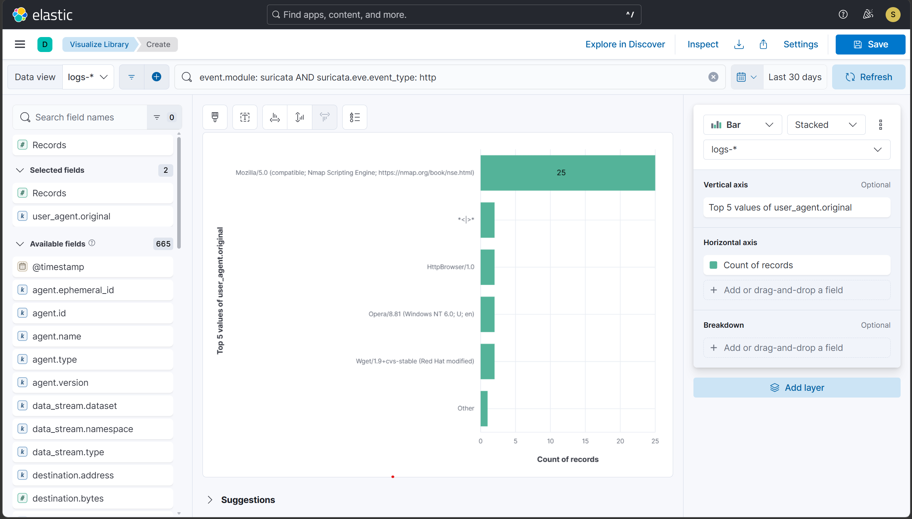
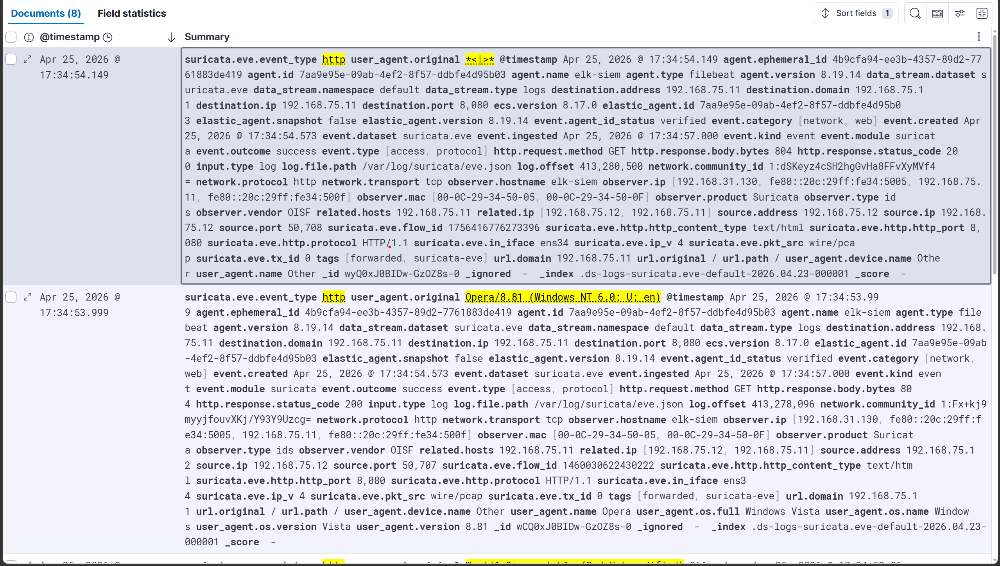
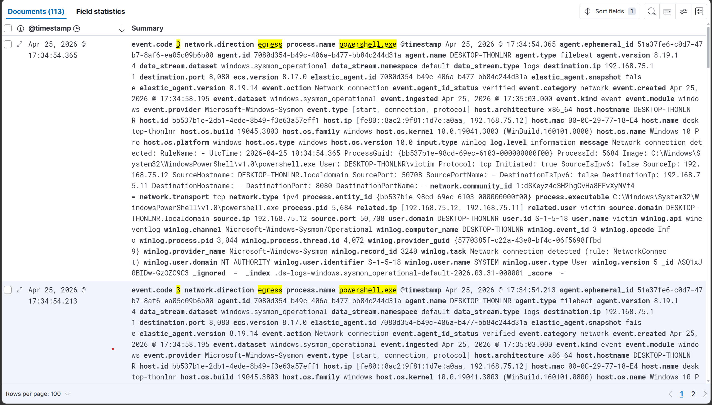
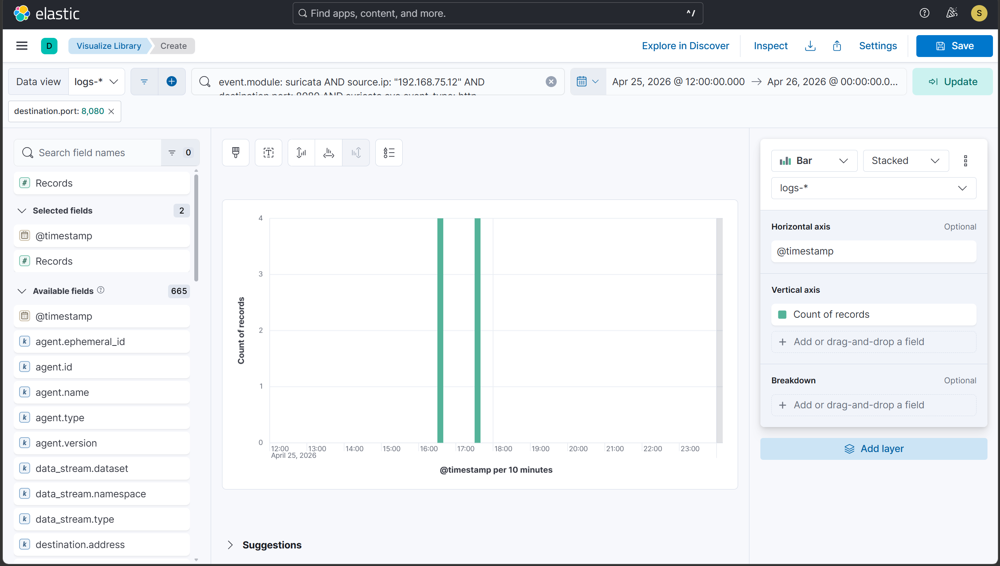
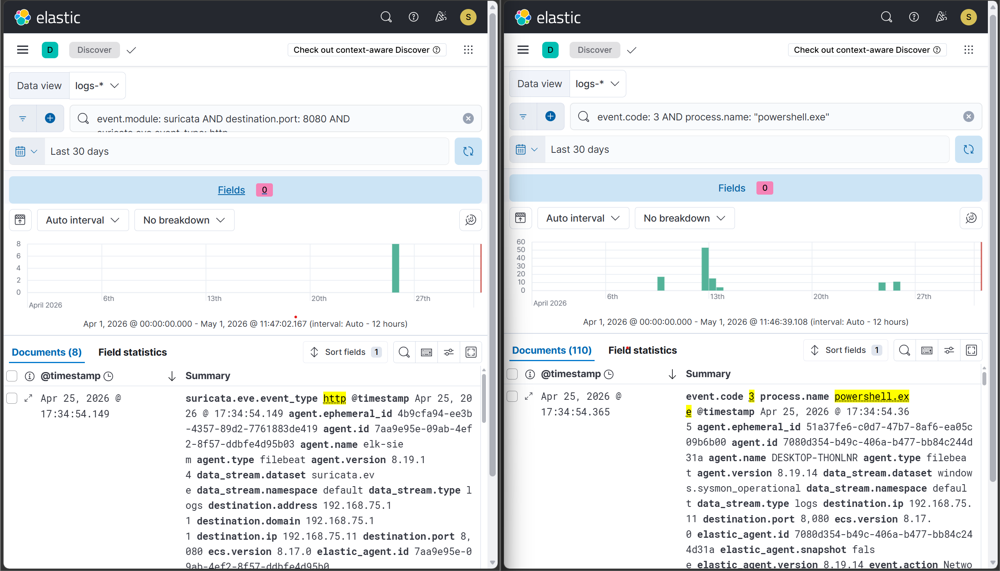

# Hunt 4 — C2 Beaconing: Anomalous HTTP Traffic and User Agent Analysis

## Hypothesis
A host on the network may be beaconing to a C2 server via HTTP
traffic — identifiable by anomalous user agent strings, unexpected
outbound connections from scripting processes, or connections to
non-standard ports that blend with legitimate web traffic.

## Trigger
T1071.001 (C2 via malicious HTTP user agents) was simulated in
Phase 8. This hunt investigates whether all four malicious user
agent strings were captured in the data and whether the existing
detection rule provides full coverage — and searches for any
additional C2 indicators not caught by rule-based detection.

## Data sources queried
- Suricata HTTP flows (suricata.eve.event_type: http) — logs-* index
- Suricata alerts (suricata.eve.event_type: alert) — logs-* index
- Sysmon Event ID 3 (NetworkConnect) — logs-* index
- Time range: Last 30 days

## Hunt queries run

### 4a — Full HTTP user agent baseline
```
event.module: suricata AND suricata.eve.event_type: http
```
Aggregated by user_agent.original in Lens.
**Results:** 6 unique user agents — 4 identified as anomalous
Breakdown:
- Mozilla/5.0 (compatible; Nmap Scripting Engine) — high frequency (~25 events)
- HttpBrowser/1.0 — low frequency
- Wget/1.9+cvs-stable — low frequency
- Opera/8.81 (Windows NT 6.0; U; en) — low frequency
- *<|>* — malformed string
- AnyConnect Darwin_i386 3.1.05160 - low frequency

Analysis:
The dominant user agent is associated with Nmap scanning activity
performed during lab testing. This is considered benign.

The remaining low-frequency user agents are anomalous and do not
correspond to legitimate browsers. These match the known malicious
user agents used in the T1071.001 simulation.

Conclusion:
User agent baselining successfully differentiated benign scanning
activity from simulated C2 traffic.

### 4b — Malicious user agent events
```
event.module: "suricata" AND
suricata.eve.event_type: http AND user_agent.original: ( *HttpBrowser* OR "*<|>*" OR *Wget/1.9+cvs* OR *Opera/8.81*)
```
**Results:** 8 events
Event details:
- User agent: HttpBrowser/1.0
- User agent: Wget/1.9+cvs-stable
- User agent: Opera/8.81 (Windows NT 6.0; U; en)
- User agent: *<|>* (malformed string)

Common characteristics:
- Source IP: 192.168.75.12 (FLARE-VM)
- Destination IP: 192.168.75.11 (ELK SIEM)
- Destination port: 8080
- HTTP method: GET
- Response status: 200 (successful requests)
- Timestamps: clustered within the same execution window (Apr 25, 2026 ~17:34)

Analysis:
These user agents are not associated with legitimate browsers and match
the known indicators used in the T1071.001 atomic test. The consistent
source, destination, and timing confirm they originate from the same
simulated C2 activity.

Conclusion:
All four malicious HTTP requests from the C2 simulation were successfully
captured and identified through user agent filtering.
### 4c — PowerShell outbound HTTP connections
```
event.code: 3 AND
process.name: "powershell.exe" AND
network.direction: egress
```
**Results:** 113 events identified, with a subset corresponding
to the C2 simulation timeframe (~17:34).

Event details:
- Process: powershell.exe
- Source IP: 192.168.75.12 (FLARE-VM)
- Destination IP: 192.168.75.11 (ELK SIEM)
- Destination port: 8080
- Protocol: TCP
- Direction: egress
- Timestamps: Apr 25, 2026 ~17:34:54

Analysis:
While numerous PowerShell network events were observed, only those
occurring within the same time window as the malicious HTTP traffic
(Hunt 4b) are relevant to the simulated C2 activity.

The timing aligns precisely with the malicious HTTP requests identified
via Suricata, indicating that PowerShell is the originating process
responsible for the simulated C2 communication.

Conclusion:
Endpoint telemetry confirms that powershell.exe executed the outbound
connections associated with the C2 simulation, providing process-level
attribution for the network activity.

### 4d — HTTP on non-standard ports
```
event.module: suricata AND suricata.eve.event_type: http AND
NOT destination.port: (80 OR 443 OR 8080)
```
**Results:** Multiple HTTP events observed on non-standard port 9200

Event characteristics:
- Source IP: 192.168.75.12 (FLARE-VM)
- Destination IP: 192.168.75.11 (ELK SIEM)
- Destination port: 9200 (Elasticsearch)
- HTTP methods: GET / HEAD
- User agent: Mozilla/5.0 (compatible; Nmap Scripting Engine) / AnyConnect Darwin_i386 3.1.05160

Analysis:
The observed traffic corresponds to HTTP requests directed at port 9200,
which is used by the Elasticsearch service in the lab environment.

The user agent and request patterns indicate that this activity is
generated by Nmap scanning (service enumeration), not C2 communication.

No suspicious beaconing patterns, external destinations, or known
malicious indicators were identified in this traffic.

Conclusion:
Non-standard HTTP traffic was present but attributed to benign
network scanning activity. No additional C2 channels beyond the
simulated port 8080 were identified.

### 4e — Beaconing pattern analysis (time-series)
Kibana Lens time histogram of connections from 192.168.75.12
filtered to destination.port: 8080.
**Result:** A distinct cluster of HTTP requests was observed from
192.168.75.12 to 192.168.75.11:8080 within a very short time window.

The spike consists of 4 requests occurring within approximately
1 second (~17:34:53–17:34:54 on Apr 25, 2026), with no sustained
or periodic communication outside this window.

Analysis:
The tightly grouped burst of requests indicates automated execution
rather than user-driven activity. Each request corresponds to a
distinct anomalous user agent identified in Hunt 4b.

This behavior is consistent with the atomic test simulation, which
generates rapid sequential HTTP requests rather than long-interval
beaconing.

Conclusion:
A burst pattern of repeated HTTP connections was observed,
consistent with simulated C2 activity. No long-term periodic
beaconing behavior was identified in the dataset.

## Findings

### ✅ Confirmed malicious — Hunt 4b
**4 HTTP requests with known APT malware user agents**
- User agents observed: HttpBrowser/1.0, Wget/1.9+cvs-stable,
  Opera/8.81 (Windows NT 6.0; U; en), *<|>*
- Source: 192.168.75.12 (FLARE-VM)
- Destination: 192.168.75.11:8080 (simulated C2 listener)
- Timestamp: Apr 25, 2026 ~17:34
- Existing alert: T1071.001 rule fired ✅
- Verdict: **Covered by existing detection**

### ✅ Confirmed — Hunt 4c
**powershell.exe making outbound connection to C2 listener**
- Process: powershell.exe → 192.168.75.11:8080
- Timestamp: Apr 25, 2026 ~17:34:54
- Note: No independent Sysmon-based alert rule exists for this
  signal — Suricata rule covers the network layer only
- Recommendation: add complementary rule:
  event.code: 3 AND process.name: "powershell.exe" AND
  NOT destination.ip: (internal_ranges)
- Verdict: **Detected via Suricata, partial endpoint coverage**

### 🔍 Investigated — Hunt 4a (baseline)
Normal user agents observed alongside malicious ones:
- Mozilla/5.0 (compatible; Nmap Scripting Engine)
- AnyConnect Darwin_i386 3.1.05160 (compatible; Nmap Scripting Engine)

Note: The presence of Nmap-generated HTTP traffic introduced
benign noise into the dataset. This required differentiation
between legitimate scanning activity and malicious C2 traffic
based on user agent patterns and frequency analysis.

### 🔍 Investigated — Hunt 4d
HTTP traffic was observed on non-standard port 9200, associated
with Elasticsearch service access.

This activity was attributed to Nmap scanning and internal lab
operations, not C2 communication.

Verdict: **No malicious non-standard port usage identified.**

## Detection gap identified
The original detection relied solely on Suricata network telemetry,
providing no visibility into the originating process.

Resolution:
A complementary Sysmon-based detection rule was implemented to
monitor outbound connections initiated by scripting engines
(e.g., PowerShell).

This enhancement enables correlation between network activity
and process-level behavior, improving detection coverage and
attribution.
```kql
Name: Suspicious PowerShell Outbound Connection
event.code: 3 AND
process.name: "powershell.exe" AND
destination.port: (4444 OR 8080 OR 8888 OR 1337)
```

## Conclusion
**Hypothesis confirmed.** C2 beaconing behavior was present in lab
data — all 4 malicious HTTP user agents from the T1071.001 simulation
were identified through proactive user agent baseline analysis.

The existing T1071.001 detection rule provides effective coverage within the scope of Suricata-visible traffic for
Suricata-observable C2 traffic. A partial endpoint-layer gap was
identified: PowerShell egress has no dedicated Sysmon-based alert,
documented above as a recommended rule addition.

User agent baselining proved effective as a hunting technique —
the malicious strings stood out immediately against normal traffic
without requiring a specific signature for each one.

## Time to hunt
Approximately 45 minutes

## Evidence




